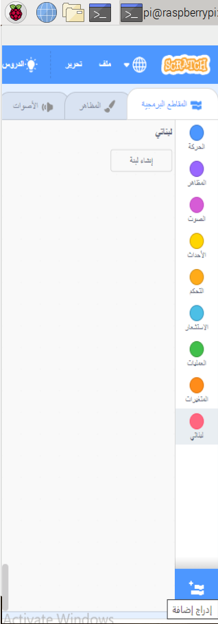

## اختبار الدائرة الخاصة بك في برنامج Scratch

ستقوم الآن بتوصيل الدائرة الخاصة بك وأول لون قوس قزح إلى Scratch، بحيث يمكنك برمجة برنامج Scratch للتحكم في مصباح LED.

--- task --- افتح Scratch 3 على Raspberry Pi.

 --- /task ---

--- task --- ثم أضف ملحق Simple Electronics الى جهاز Raspberry Pi



 --- /task ---

--- task --- في الخطوة السابقة، قمت بتوصيل LED إلى منفذ **3V3**. هذا هو المنفذ المراد الاتصال به إذا كنت تختبر LED الخاص بك. تحتاج الآن إلى توصيل LED الخاص بك إلى منفذ يمكنك التحكم به باستخدام Scratch. انقل السلك من المنفذ **3V3** إلى منفذ جديد، على سبيل المثال **GPIO 17**. --- /task ---


--- task --- الآن اختبر أنه يمكن التحكم في LED باستخدام البرنامج النصي البسيط التالي

```blocks3
when flag clicked
turn LED (17 v) [on v] ::extension
wait (1) secs
turn LED (17 v) [off v] ::extension
```

--- /task ---

--- task --- انقر على العلم الأخضر لتشغيل البرنامج. ينبغي أن يعمل المصباح LED لمدة ثانية واحدة. --- /task ---