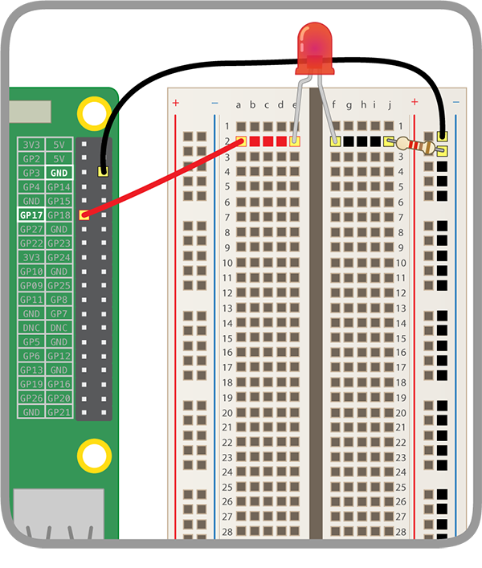
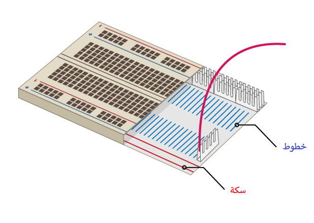
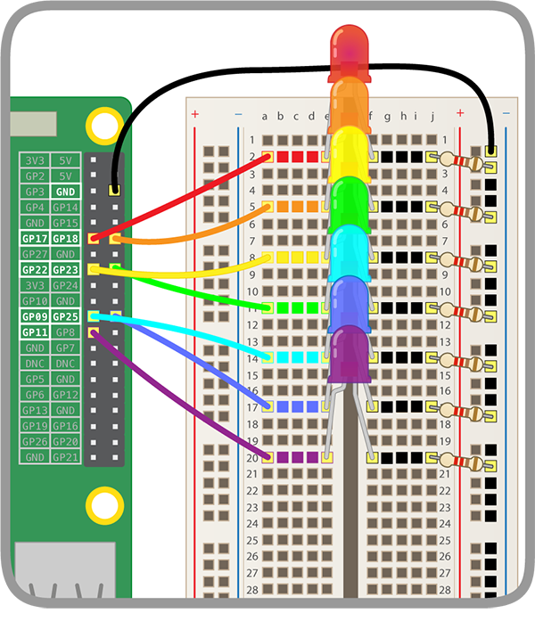

## بناء قوس قزحك

في هذه الخطوة، ستقوم بتجميع قوس قزحك وبرمجة مصابيح LED لتضيء على شكل قوس قزح.

--- task --- ابحث عن جميع المصابيح التي ستستخدمها وتأكد من أن لديك أيضًا العدد الصحيح من أسلاك التوصيل والمقاومات (واحد لكل جهاز LED). --- /task ---

--- task --- أعد ترتيب الدائرة التي لديك لتجعل مساحة للألوان الأخرى من قوس قزح. --- /task ---

### اربط قوس قزح بالارض

--- task --- بحيث أن قوس القزح الخاص بك يشرق ولا يغطيه الكثير من أسلاك التوصيل، جميع مصابيح LEDs يجب أن يتشارك بمنفذ واحد **أرضيةGround (GND)**. يمكنك إعدادهم هكذا عن طريق إعادة ترتيب مكوناتك قليلاً على اللوحة.

هكذا تبدو اللوحة من الداخل:

لربط كل القوس قزح مع سلك توصيل واحد: --- /task ---

--- task --- قم بتوصيل السلك المرتبط بـ **GND** إلى **لوح** التوصيل --- /task ---

--- task --- تأكد من اتصال المقاومات بنفس الخط من اللوح المرتبط بالسلك **GND** وبنفس الشريط **** الذي ينتمون إليه: --- /task ---

### أكمال قوس القزح

--- task --- أضف بقية مصابيح LED الخاصة بك، وأسلاك التوصيل، والمقاومات إلى اللوحة بترتيب الالزان الذي تختاره. تأكد من ترك المجال لزر في النهاية. --- /task ---

إذا كنت تستخدم ألواناً مختلفة، فقد يساعدك أن تطابق لون أسلاك التوصيل مع مصابيح LED الخاصة بك.

قوس القزح الخاص بك يجب أن يبدو مماثلاً لهذا القوس:

