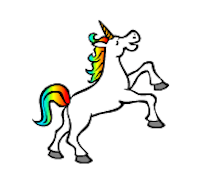
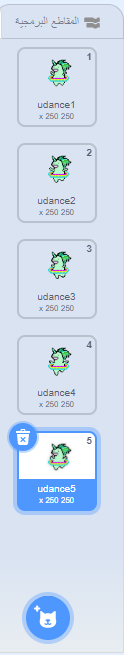

## اجعل وحيد القرن برقص على قوس قزحك

في هذه الخطوة، سوف تبرمج وحيد القرن في Scratch ليرقص على إيقاع قوس القزح. سوف تستخدم الزر لبرمجة قوس قزحك وحيد القرن الراقص.

### كائن وحيد القرن

اختر أحد الخيارات التالية لإنشاء كائن أحادي القرن:

1. استخدم كائن وحيد القرن في Scratch
2. حمّل صورة أحادي القرن من مكان آخر واستخدامها ككائن لديك
3. ارسم كائن وحيد القرن الخاص بك في Scratch أو برنامج آخر (مثل وحيد القرن الأخضر اللطيف على اليمين).

أمثلة:

|               (1) كائن Scratch:                |            (2) Upload your own:             |             (3) ارسم بنفسك:             |
|:----------------------------------------------:|:-------------------------------------------:|:---------------------------------------:|
|  |  |  |

\--- task \--- إذا اخترت الخيار 1، انقر هنا: [[[generic-scratch3-sprite-from-library]]] \--- /task \---

\--- task \--- إذا اخترت الخيار 2 لأنك تريد تحميل صورة أحادي القرن التي وجدتها في مكان آخر، انقر أدناه أولا لمعرفة أذونات الصورة، ثم استخدم التعليمات في المربع التالي لتحميل الملف الخاص بك: [[[images-permissions-to-use]]]

[[[generic-scratch3-sprite-from-library]]] \--- /task \---

\--- task \--- إذا كنت تذهب مع الخيار 3، انقر أدناه للحصول على تعليمات حول كيفية رسم وحيد القرن الخاص بك في Scratch: [[[generic-scratch3-draw-sprite]]] \--- /task \---

### مظاهر وحيد القرن

يحتاج وحيد القرن الخاص بك إلى **مظاهر أو أزياء** ليتمكن من الرقص. المظهر هو واحد من مجموعة من الاشكال للكائن، مما يعني أن الكائنات يمكنها تغيير أشكالها بتغيير مظاهرها. لذلك، يمكنك استخدام الأزياء لجعل كائن يبدو وكأنه يتحرك كلما كنت تريد إنشاء رسوم متحركة.

هنا ، سنقوم بإنشاء رسم متحرك لوحيد قرن راقص، لذا كل زي سيمثل حركة رقص لوحيد القرن الخاص بك.

\--- task \--- حدد عدد الأزياء التي تريدها لكائن وحيد القرن الخاص بك للرقص، و قم بتحرير مظاهرك وفقا لذلك.

انقر للحصول على تذكير حول كيفية إضافة مظاهر في Scratch: [[[generic-scratch3-add-costume]]]

انقر للحصول على تذكير حول كيفية مضاعفة المظاهر في Scratch: [[[generic-scratch3-duplicate-costumes]]] \--- /task \---

والأمر متروك لك كم عدد المظاهر التي تريد إضافتها لوحيد القرن الراقص الخاص بك. لهذا وحيد القرن الاخضر الراقص، استخدمنا خمسة مظاهر:

|  |  |

### رقصة وحيد القرن

لإنشاء الرسوم المتحركة للرقص، تحتاج إلى برمجة وحيد القرن ليبدل مظهره.

\--- task \--- قم بالتبديل بين المظهرين الأولين لبدء رقص وحيد القرن.

للانتقال من المظهر الأول إلى الثاني استخدم:

```blocks3
switch costume to [costume 2 v]
```

وحيدي القرن راقصين جيدين بشكل عام، لذا تأكد من وقت رقص وحيد القرن الخاص بك مناسب إلى سرعة وميض قوس قزح. يمكنك استخدام الكتلة `انتظر `{:class="blockcontrol"} لمطابقة وقت انتظار وحيد القرن مع وقت انتظار قوس قزح.

```blocks3
wait (0.5) secs
switch costume to [costume 2 v]
```

\--- /task \---

\--- task \--- لإنشاء وحيد القرن الرقص الخاصة بك، قم بالتبديل باستمرار بين جميع المظاهر. ما نوع الحلقة التكرارية التي تحتاجها للقيام بهذا؟ \--- /task \---

\--- hints \--- \--- hint \---

استخدم حلقة كرر باستمرار:

```blocks3
كرر باستمرار
```

\--- /hint \--- \--- hint \---

استخدم هذه الكتلة للتبديل إلى المظهر التالي في كل مرة تمر من خلال الحلقة:

```blocks3
next costume
```

\--- /hint \--- \--- hint \---

يجب أن تبدو التعليمات البرمجية خاصتك بالشكل التالي:

```blocks3
forever
wait (0.5) secs
next costume
```

\--- /hint \--- \--- /hints \---