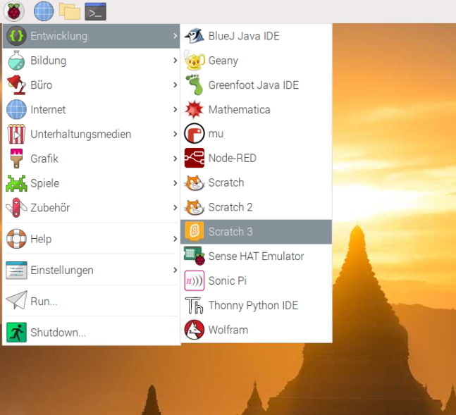
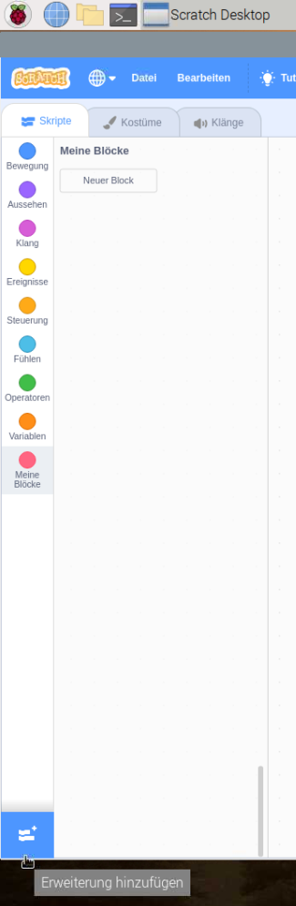
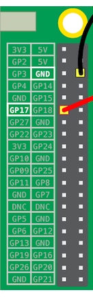

## Teste deine Schaltung in Scratch

Du wirst jetzt deine Schaltung und deine erste Regenbogenfarbe mit Scratch verbinden, damit du ein Scratch-Programm schreiben kannst um die LED zu steuern.

--- task --- 

Öffne Scratch 3 auf deinem Raspberry Pi.

 

--- /task ---

--- task --- 

Füge dann die Erweiterung "Raspberry Pi Simple Electronics" hinzu



 

--- /task ---

--- task --- 

Im vorherigen Schritt hast du deine LED mit dem **3V3** Pin verbunden. Das ist der Pin, den du verbindest, wenn du deine LED testest. Jetzt musst du deine LED an einen Pin anschließen, den du mit Scratch kontrollieren kannst. Verschiebe den Draht von Pin **3v3** auf einen neuen Pin, zum Beispiel **GPIO 17**. 

--- /task ---



--- task --- 

Teste nun mit dem folgenden einfachen Skript, ob die LED gesteuert werden kann

```blocks3
when flag clicked
turn LED (17 v) [on v] ::extension
wait (1) secs
turn LED (17 v) [off v] ::extension
```

--- /task ---

--- task --- 

Klicke auf die grüne Flagge, um dein Skript auszuführen. Die LED sollte 1 Sekunde lang leuchten. 

--- /task ---