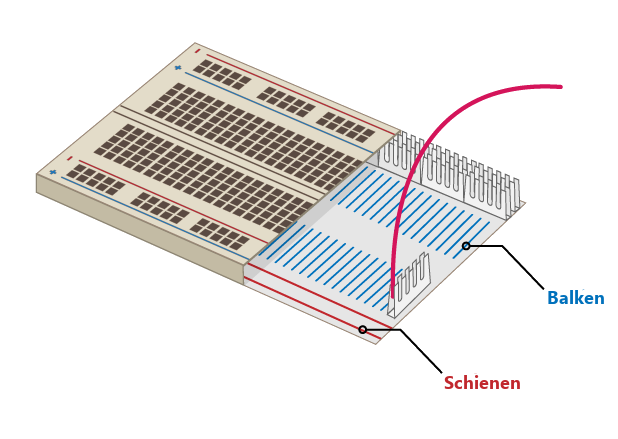

## Baue deinen Regenbogen

In diesem Schritt wirst deinen Regenbogen zusammenbauen und seine LEDs so programmieren, dass sie in einem Regenbogenmuster blinken.

--- task --- 

Nimm alle LEDs, die du verwenden wirst, und stell sicher, dass du auch die richtige Anzahl an Überbrückungskabeln und Wiederständen hast (jeweils eins pro LED). 

--- /task ---

--- task --- 

Ordne die Schaltung neu an, um Platz für die anderen Farben deines Regenbogens zu schaffen. 

--- /task ---

### Erde den Regenbogen

--- task --- 

Damit dein Regenbogen hell strahlen kann und nicht von zu vielen Drähten verdeckt wird, sollten sich alle LEDs einen **Masse/Ground (GND)**-Pin teilen. Du kannst sie so einrichten, indem du die Komponenten auf dem Steckbrett ein wenig umordnest.

Das Steckbrett sieht innen so aus:

Um den gesamten Regenbogen mit einem Draht zu erden: 

--- /task ---

--- task --- 

Verbinde den Draht, der mit **GND** verbunden ist mit einer Steckbrett-**Schiene** 

--- /task ---

--- task --- 

Stelle sicher dass die Widerstände mit derselben Schiene wie der **GND**-Draht und mit demselben **Balken** wie die jeweils zugehörige LED verbunden ist: 

--- /task ---

### Vervollständige den Regenbogen

--- task --- 

Füge deine restlichen LEDs, Überbrückungskabel und Widerstände in einer Farbfolge deiner Wahl hinzu. Stelle sicher am Ende Platz für einen Taster zu lassen. 

--- /task ---

Wenn du viele verschiedene Farben verwendest, hilft es vielleicht die Farben der Überbrückungskabel mit denen deiner LEDs abzustimmen.

Dein Regenbogen sollte so ähnlich wie dieser aussehen:

