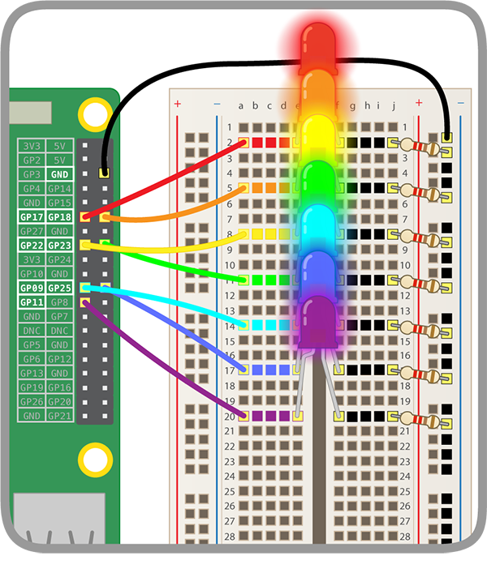

## Erleuchte deinen Regenbogen

Um sicherzustellen, dass dein Regenbogen funktioniert, wirst du ihn zuerst testen indem du den gesamten Regenbogen auf einmal erleuchtest. Dann wirst du Code erzeugen um den Regenbogen nacheinander durch alle seine Farben blinken zu lassen und dann in einem Muster deiner Wahl.

--- task ---

Füge mehr Code hinzu um die anderen LEDs zu steuern. Stelle sicher, dass du die richtigen GPIO-Pins angibst. 

--- /task ---

Dein Regenbogen sollte so leuchten:



--- hints --- 
--- hint --- 

Füge mehr `turn LED (0 v) [on v]`{:class="block3extensions"}-Blöcke zu diesem Codeabschnitt hinzu:

```blocks3
when flag clicked
turn LED (17 v) [on v] ::extension
```

--- /hint --- 
--- hint --- 

Füge solange weitere Blöcke am Ende deines Codes hinzu bis alle deine LEDs auf `on`{:class="block3extensions"} gesetzt sind.

```blocks3
when flag clicked
turn LED (17 v) [on v] ::extension
turn LED (18 v) [on v] ::extension
turn LED (22 v) [on v] ::extension
```

--- /hint --- 
--- hint ---

Falls deine LEDs nicht leuchten:

 1) Überprüfe an welchen GPIO-Pins deine LEDs angeschlossen sind und stelle sicher, dass du sie auf `on`{:class="block3extensions"} gesetzt hast 
 2) Teste ob die LEDs funktionieren — du kannst das Überbrückungskabel einer LED auf den **GPIO 3V3** Pin stecken um sie zu testen 
 3) Stelle sicher, dass die Schaltung auf dem Steckbrett vollständig ist

--- /hint --- 
--- /hints ---

--- task --- 

Füge jetzt mehr Code hinzu, um den Regenbogen wie folgt in einem Regenbogenmuster blinken zu lassen:<video width="560" height="315" controls> <source src="resources/Scratch-GPIO-Pathways-5.mp4" type="video/mp4"> Dein Browser unterstützt das Video-Tag nicht, versuche es mit FireFox oder Chrome. </video> 

Um das zu tun, wirst du eine LED für einige Sekunden einschalten und dann, gleichzeitig mit dem Einschalten der nächsten LED, wieder ausschalten müssen. 

--- /task ---

--- hints --- 
--- hint ---

Stelle sicher, dass dein `Ereignis`{:class="blockevents"}-Block mit dem übereinstimmt, was du tust um dem Code zu testen. Im Beispiel hier müssen wir auf die grüne Flagge klicken, um unseren Regenbogen blinken zu lassen:

```blocks3
when flag clicked
```

--- /hint --- 
--- hint ---

Falls du nicht mehr weiter kommst, stelle sicher, dass du diese Blöcke verwendest:

```blocks3
turn LED (0 v) [off v] ::extension
wait () secs
```

--- /hint --- 
--- hint ---

Versuche diesen Ansatz:

```blocks3
when flag clicked
turn LED (17 v) [on v] ::extension
wait (0.5) secs
turn LED (17 v) [off v] ::extension
turn LED (18 v) [on v] ::extension
wait (0.5) secs
turn LED (18 v) [off v] ::extension
turn LED (22 v) [on v] ::extension
```

Du musst Blöcke für alle deine LEDs hinzufügen und sicher stellen, dass du die richtigen GPIO-Pin-Nummern in deinem Code verwendest.

--- /hint --- 
--- /hints ---

--- task --- 

Lass die Lichter in einer Schleife wiederholt durch den Regenbogen blinken.

Um das Regenbogenmuster für immer zu wiederholen verwende:

```blocks3
forever
```

--- /task ---

--- challenge ---

+ Lass den Regenbogen in einem Muster deiner Wahl blinken.

--- collapse ---
---
title: Regenbogen-Herausforderungen
---
Probiere folgende Ideen aus:

 1) Lass die LEDs ganz schnell und ganz langsam blinken 
 2) Lass den ganzen Regenbogen blinken 
 3) Lass LED-Paare in abwechselnden Mustern aufleuchten 
 4) Lass den Regenbogen etwas im Morsecode blinken 
 5) Lass den Regenbogen verschiedene Dinge als Reaktion auf unterschiedliche Ereignisse machen

--- /collapse --- 
--- /challenge ---