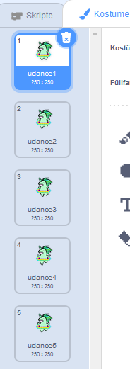

## Lass ein Einhorn zu deinem Regenbogen tanzen

In diesem Schritt wirst du ein Einhorn in Scratch so programmieren, dass es im Rythmus deines Regenbogens tanzt. Du wirst einen Taster verwenden um deinen Regenbogen und dein tanzendes Einhorn zu programmieren.

### Einhorn-Figur

Wähle eine der folgenden Optionen um eine Einhorn-Figur zu erstellen:

1. Benutze die Scratch "Unicorn" Figur
2. Lade ein Einhornbild von einem anderen Ort hoch und nutze dieses als deine Figur
3. Zeichne deine eigene Einhornfigur in Scratch oder einem anderen Programm (wie das hübsche grüne Einhorn rechts).

Beispiele:

|              (1) Scratch-Figur:               |      (2) Lade deine eigene hoch:      |            (3) Zeichne deine eigene:            |
|:---------------------------------------------:|:-------------------------------------:|:-----------------------------------------------:|
|  |  |  |

\--- task \--- Falls du Option 1 gewählt hast, klick hier: [[[generic-scratch3-sprite-from-library]]] \--- /task \---

\--- task \--- Falls du Option 2 gewählt hast, weil du ein Einhornbild hochladen möchtest, das du woanders gefunden hast, klicke zuerst unten um mehr über Bildrechte zu lernen und verwende dann die Anleitung in der zweiten Box um deine Datei hochzuladen: [[[images-permissions-to-use]]]

[[[generic-scratch3-sprite-from-library]]] \--- /task \---

\--- task \--- Falls du mit Option 3 weiter machen willst, klicke unten für eine Anleitung, wie du dein eigenes Einhorn in Scratch malen kannst: [[[generic-scratch3-draw-sprite]]] \--- /task \---

### Einhornkostüme

Dein Einhorn benötigt **Kostüme** um tanzen zu können. Ein Kostüm gehört zu einer Reihe von Erscheinungen einer Figur, was bedeutet, dass Sprites ihr Aussehen ändern können, indem sie ihre Kostüme wechseln. Daher kannst du Kostüme verwenden um eine Figur so aussehen zu lassen als würde sie sich bewegen, wann immer du eine Animation erstellen möchtest.

Hier erstellen wir eine tanzende Einhornanimation, sodass jedes Kostüm eine Tanzbewegung deines Einhorns darstellt.

\--- task \--- Entscheide, wie viele Kostüme deine Einhornfigur für den Tanz haben soll und bearbeite deine Kostüme entsprechend.

Klicke hier für eine Erinnerung, wie man Kostüme in Scratch hinzufügt: [[[generic-scratch3-add-costume]]]

Klicke hier für eine Erinnerung, wie man Kostüme in Scratch dupliziert: [[[generic-scratch3-duplicate-costumes]]] \--- /task \---

Es liegt ganz bei dir, wie viele Kostüme du für dein Tanzeinhorn hinzufügen möchtest. Für dieses tanzende grüne Einhorn haben wir fünf Kostüme verwendet:

|  |  |

### Einhorn-Tanz

Um deine Tanzanimation zu erstellen, musst du das Einhorn programmieren, um Kostüme zu wechseln.

\--- task \--- Wechsle zwischen den ersten beiden Kostümen um den Einhorntanz zu starten.

Um vom ersten zum zweiten Kostüm zu wechseln, verwende:

```blocks3
switch costume to [costume 2 v]
```

Einhörner sind im Allgemeinen gute Tänzer. Stelle daher sicher, dass du den Tanz deines Einhorns auf die Geschwindigkeit deines Regenbogenmusters einstellst. Du kannst den `warte`{:class="blockcontrol"}-Block verwenden, um die Wartezeit des Einhorns an die Wartezeit deines Regenbogens anzupassen.

```blocks3
wait (0.5) secs
switch costume to [costume 2 v]
```

\--- /task \---

\--- task \--- Wechsle kontinuierlich zwischen allen Kostümen, um dein tanzendes Einhorn zu erschaffen. Was für eine Schleife brauchst du dafür? \--- /task \---

\--- hints \--- \--- hint \---

Verwende eine fortlaufende-Schleife:

```blocks3
wiederhole fortlaufend
end
```

\--- /hint \--- \--- hint \---

Benutze diesen Block, um jedes Mal, wenn du durch die Schleife gehst, zum nächsten Kostüm zu wechseln:

```blocks3
next costume
```

\--- /hint \--- \--- hint \---

Dein Code sollte so aussehen:

```blocks3
forever
wait (0.5) secs
next costume
```

\--- /hint \--- \--- /hints \---