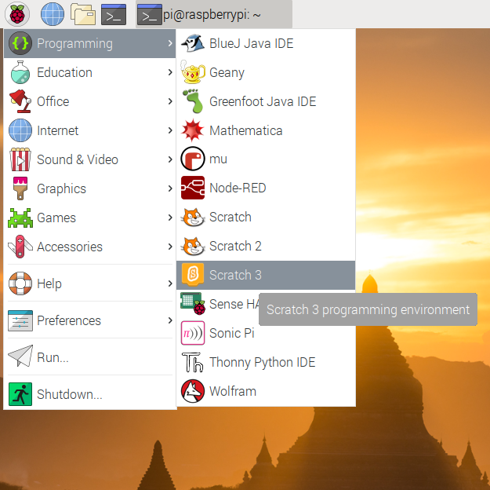
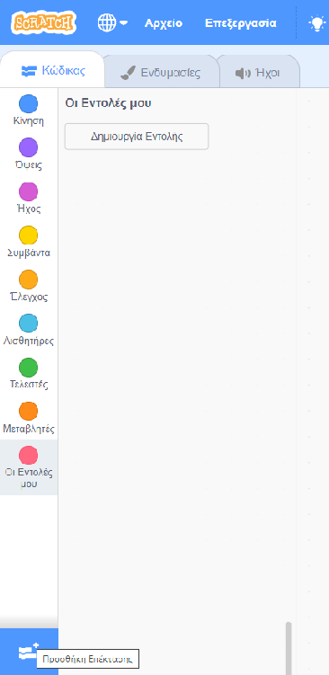
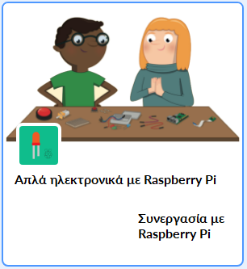

## Δοκίμασε το κύκλωμά σου στο Scratch

Τώρα θα συνδέσεις το κύκλωμά σου και το πρώτο χρώμα του ουράνιου τόξου στο Scratch, έτσι ώστε να μπορείς να προγραμματίσεις ένα πρόγραμμα Scratch για να ελέγξεις τη λυχνία LED.

--- task --- Άνοιξε το Scratch 3 στο Raspberry Pi.

 --- /task ---

--- task --- Στη συνέχεια πρόσθεσε την επέκταση Raspberry Pi Simple Electronics



 --- /task ---

--- task --- Στο προηγούμενο βήμα, σύνδεσες το LED σου με την ακίδα **3V3**. Αυτή είναι η ακίδα στην οποία συνδέεις αν δοκιμάζεις το LED σου. Τώρα πρέπει να συνδέσεις το LED σου με μια ακίδα που μπορείς να ελέγξεις με το Scratch. Μετακίνησε το καλώδιο από την ακίδα **3V3** σε μια νέα ακίδα, για παράδειγμα την **GPIO 17**. --- /task ---


--- task --- Τώρα δοκίμασε ότι η λυχνία μπορεί να ελεγχθεί χρησιμοποιώντας το παρακάτω απλό script

```blocks3
when flag clicked
turn LED (17 v) [on v] ::extension
wait (1) secs
turn LED (17 v) [off v] ::extension
```

--- /task ---

--- task --- Κάνε κλικ στην πράσινη σημαία για να τρέξεις το πρόγραμμά σου. Η λυχνία LED πρέπει να ανάψει για 1 δευτερόλεπτο. --- /task ---