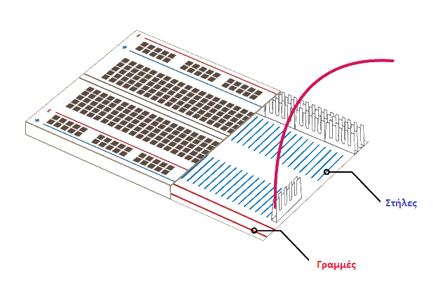

## Κατασκεύασε το ουράνιο τόξο σου

Σε αυτό το βήμα, θα συναρμολογήσεις το ουράνιο τόξο σου και θα προγραμματίσεις τα LED του να αναβοσβήνουν σε ένα μοτίβο ουράνιου τόξου.

\--- task \--- Βρες όλες τις λυχνίες LED που πρόκειται να χρησιμοποιήσεις και βεβαιώσου ότι έχεις επίσης τον σωστό αριθμό καλωδίων και αντιστάσεων (ένα από το καθένα ανά LED). \--- /task \---

\--- task \--- Αναδιάταξε το κύκλωμα που έχεις ήδη για να κάνεις χώρο για τα άλλα χρώματα του ουράνιου τόξου σου. \--- /task \---

### Γείωσε το ουράνιο τόξο

\--- task \--- Για να λάμπει το ουράνιο τόξο σου έντονα και να μην καλύπτεται από πάρα πολλά καλώδια διασύνδεσης, όλα τα LED θα πρέπει να μοιράζονται μια ακίδα **Ground (GND)**. Μπορείς να τα ρυθμίσεις έτσι, αναδιατάσσοντας λίγο τα στοιχεία σου στην πλακέτα δοκιμών.

Η πλακέτα δοκιμών εσωτερικά μοιάζει κάπως ετσι:

Για τη γείωση ολόκληρου του ουράνιου τόξου με ένα καλώδιο: \--- /task \---

\--- task \--- Σύνδεσε το καλώδιο που είναι συνδεδεμένο στο **GND** σε μια **ράγα** στην πλακέτα δοκιμών \--- /task \---

\--- task \--- Βεβαιώσου ότι οι αντιστάσεις συνδέονται στην ίδια ράγα με το καλώδιο **GND** και στην ίδια **γραμμή** με το LED που ανήκουν \--- /task \---

### Ολοκλήρωσε το ουράνιο τόξο

\--- task \--- Πρόσθεσε τα υπόλοιπα LED, καλώδια και αντιστάσεις στην πλακέτα δοκιμών σε μια χρωματική διάταξη της επιλογής σου. Βεβαιώσου ότι έχεις αφήσει χώρο για ένα κουμπί στο τέλος. \--- /task \---

Εάν χρησιμοποιείς πολλά διαφορετικά χρώματα, ίσως βοηθήσει το να ταιριάξεις το χρώμα των καλωδίων με αυτά των LED σου.

Το ουράνιο τόξο σου θα πρέπει να μοιάζει με αυτό:

