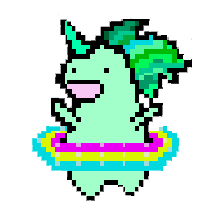
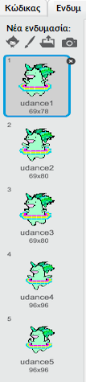

## Κάνε έναν μονόκερο να χορεύει με το ουράνιο τόξο σου

Σε αυτό το βήμα, θα προγραμματίσεις έναν μονόκερο στο Scratch να χορεύει στο ρυθμό του ουράνιου τόξου σου. Θα χρησιμοποιήσεις ένα κουμπί για να προγραμματίσεις το ουράνιο τόξο και τον μονόκερο που χορεύει.

### Χαρακτήρας μονόκερου

Επίλεξε μία από τις παρακάτω επιλογές για να δημιουργήσεις έναν χαρακτήρα μονόκερου:

1. Χρησιμοποίησε τον χαρακτήρα μονόκερου του Scratch
2. Ανέβασε μία φωτογραφία μονόκερου και χρησιμοποίησε την ως χαρακτήρα σου
3. Ζωγράφισε τον δικό σου χαρακτήρα μονόκερου στο Scratch ή σε άλλο πρόγραμμα (όπως ο πράσινος μονόκερος στα δεξιά).

Παραδείγματα:

|             (1) Χαρακτήρας στο Scratch:             |             (2) Ανέβασε το δικό σου:              |            (3) Σχεδίασε το δικό σου:             |
|:---------------------------------------------------:|:-------------------------------------------------:|:------------------------------------------------:|
|  |  |  |

--- task --- Αν επέλεξες την επιλογή 1, κάνε κλικ εδώ: 
[[[generic-scratch3-sprite-from-library] 
--- /task ---

--- task --- Αν επέλεξες την επιλογή 2 επειδή θέλεις να ανεβάσεις μια εικόνα μονόκερου που βρήκες κάπου αλλού, κάνε κλικ παρακάτω παρακάτω για να μάθεις περισσότερα για τα δικαιώματα εικόνας και, στη συνέχεια, χρησιμοποίησε τις οδηγίες στο δεύτερο πλαίσιο για να ανεβάσεις το αρχείο σου: 
[[[images-permissions-to-use]]]

[[[generic-scratch3-sprite-from-library]]] 
--- /task ---

--- task --- Εάν συνεχίσεις με την επιλογή 3, κάνε κλικ παρακάτω για οδηγίες σχετικά με το πώς να σχεδιάσεις το δικό σου μονόκερο στο Scratch: 
[[[generic-scratch3-draw-sprite] 
--- task ---

### Ενδυμασίες μονόκερου

Ο μονόκερος σου χρειάζεται **ενδυμασίες** για να μπορέσει να χορέψει. Μία ενδυμασία είναι μια από τις εμφανίσεις ενός χαρακτήρα, που σημαίνει ότι οι χαρακτήρες μπορούν να αλλάξουν την εμφάνισή τους αλλάζοντας ενδυμασίες. Επομένως, μπορείς να χρησιμοποιήσεις ενδυμασίες για να κάνεις έναν χαρακτήρα να φαίνεται σαν να κινείται κάθε φορά που θέλεις να δημιουργήσεις μια κινούμενη εικόνα.

Εδώ, θα δημιουργήσουμε ένα κινούμενο σχέδιο μονόκερου που χορεύει, έτσι κάθε ενδυμασία θα αντιπροσωπεύει μια χορευτική κίνηση του μονόκερού σου.

--- task --- Αποφάσισε πόσες ενδυμασίες θέλεις να έχει ο μονόκερος για τον χορό, και τροποποίησε τις ενδυμασίες σου ανάλογα.

Κάνε κλικ για μια υπενθύμιση σχετικά με τον τρόπο προσθήκης ενδυμασιών στο Scratch: 
[[[generic-scratch3-add-costume]]]

Κάνε κλικ για μια υπενθύμιση σχετικά με τον τρόπο αντιγραφής ενδυμασιών στο Scratch: 
[[[generic-scratch3-duplicate-costumes] 
--- /task ---

Εξαρτάται από εσένα πόσες ενδυμασίες θέλεις να προσθέσεις για τον χορό του μονόκερου. Για αυτόν τον χορό του πράσινου μονόκερου, χρησιμοποιήσαμε πέντε ενδυμασίες:

|  |  |

### Ο χορός του μονόκερου

Για να δημιουργήσεις το κινούμενο χορό σου, πρέπει να προγραμματίσεις τον μονόκερο ώστε να αλλάζει ενδυμασίες.

--- task --- Κάνε εναλλαγή μεταξύ των δύο πρώτων ενδυμασιών για να ξεκινήσεις τον χορό του μονόκερου.

Για να μεταβείς από την πρώτη στη δεύτερη ενδυμασία χρησιμοποίησε:

```blocks3
switch costume to [costume 2 v]
```

Οι μονόκεροι είναι γενικά καλοί χορευτές, οπότε βεβαιώσου ότι έχεις συγχρονίσει τον χορό του μονόκερου με την ταχύτητα του μοτίβου του ουράνιου τόξου σου. Μπορείς να χρησιμοποιήσεις το μπλοκ `περιμένε`{:class="blockcontrol"} για να ταιριάξεις τον χρόνο αναμονής του μονόκερου με τον χρόνο αναμονής του ουράνιου τόξου.

```blocks3
wait (0.5) secs
switch costume to [costume 2 v]
```

--- /task ---

--- task --- Για να δημιουργήσεις το χορό του μονόκερου σου, άλλαζε συνεχώς ανάμεσα σε όλες τις ενδυμασίες. Τι είδους βρόχο χρειάζεσαι για να το κάνεις αυτό; --- /task ---

--- hints ---
 --- hint ---

Χρησιμοποίησε ένα βρόχο "για πάντα":

```blocks3
για πάντα
```

--- /hint --- --- hint ---

Χρησιμοποίησε αυτό το μπλοκ για να μεταβαίνεις στην επόμενη ενδυμασία κάθε φορά που περνάς από το βρόχο:

```blocks3
next costume
```

--- /hint --- --- hint ---

Ο κώδικας θα πρέπει να μοιάζει κάπως έτσι:

```blocks3
forever
wait (0.5) secs
next costume
```

--- /hint ------ /hints ---