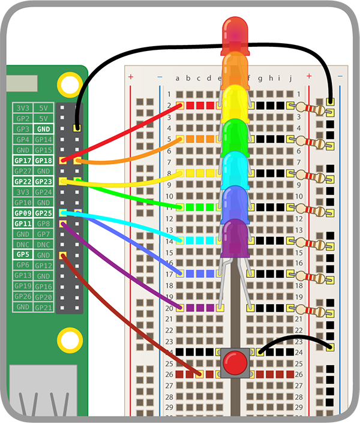

## Πρόσθεσε ένα κουμπί

Τώρα θα κάνεις το ουράνιο τόξο να ανάβει και τον μονόκερο να χορεύει στο ρυθμό του πιέζοντας ένα κουμπί!

### Σύνδεσε το κουμπί

--- task --- Σύνδεσε το κουμπί σου με την πλακέτα δοκιμών και μια ακίδα GPIO.

Κάνε κλικ παρακάτω για οδηγίες σχετικά με τον τρόπο σύνδεσης ενός κουμπιού στο Raspberry Pi. Σημείωσε ότι, αντί για το **GPIO 17** όπως λένε οι οδηγίες, χρησιμοποιήσαμε το **GPIO 5** για το κουμπί -- Το **GPIO 17** χρησιμοποιείται ήδη από ένα LED.

[[[rpi-gpio-wiring-a-button]]]

Το ουράνιο τόξο σου θα πρέπει τώρα να μοιάζει με αυτό:

 --- /task ---

### Προγραμμάτισε το κουμπί

--- task --- Χρησιμοποίησε το μπλοκ που φαίνεται παρακάτω, ώστε το κουμπί σου να μπορεί να κάνει τον χορό μονόκερου.

```blocks3
when button (5 v) is [pressed v] :: hat extension
```

--- /task ---

### Έλεγξε τον χορό του μονόκερου

Προς το παρόν, θα πρέπει να έχεις τρία κομμάτια κώδικα Scratch:

1. Κώδικας χορού μονόκερου
2. Κώδικας ουράνιου τόξου
3. Κώδικας κουμπιού

Τώρα θα συνδέσεις αυτά τα κομμάτια έτσι ώστε ο μονόκερός σου να χορεύει ταυτόχρονα με το ουράνιο τόξο και έτσι να μπορείς να ελέγξεις το ουράνιο τόξο και τον μονόκερο πατώντας το κουμπί που έχεις προσθέσει.

--- task --- Σβήσε όλα τα μπλοκ `πες`{:class="block3looks"} στον κώδικα για το κουμπί και μετά διπλασίασε αυτό το κομμάτι του κώδικα. --- /task ---

--- task --- Στον κώδικά σου για τον χορό του μονόκερου, σβήσε το μπλοκ `όταν πατηθεί η σημαία`{:class="block3events"}. Πάρε τον υπόλοιπο κώδικα του μονόκερου και τοποθέτησέ τον στο μπλοκ `αλλιώς`{:class="block3control"} του κώδικα κουμπιού. Τοποθέτησέ το μόνο σε **ένα αντίγραφο** του κώδικα κουμπιού. --- /task ---

--- task --- Στον κώδικα ουράνιου τόξου, σβήσε το μπλοκ `όταν πατηθεί η σημαία`{:class="block3events"} και τοποθέτησε τον υπόλοιπο κώδικα του ουράνιου τόξου στο μπλοκ `αλλιώς`{:class="block3control"} του **άλλου αντίγραφου** του κώδικα κουμπιού. --- /task ---

--- task --- Στο σημείο `αν`{:class="block3control"} και των δύο αντιγράφων του κώδικα κουμπιού, πρόσθεσε μία ενέργεια. Θα μπορούσες να χρησιμοποιήσεις το `άλλαξε στην πρώτη ενδυμασία`{:class="block3looks"}, έτσι ώστε ο μονόκερος να μην μπερδεύει τις χορευτικές κινήσεις του. --- /task ---

--- hints ---
 --- hint --- Εάν πατώντας το κουμπί δεν κάνει το ουράνιο τόξο να ανάψει και τον μονόκερο να χορέψει ταυτόχρονα, δοκίμασε να ελέγξεις ότι:

1. Κάθε εξάρτημα είναι συνδεδεμένο στη σωστή ακίδα GPIO
2. Έχεις δηλώσει σωστά τις εισόδους και τις εξόδους στον κώδικά σου
3. Οι χρονισμοί στα δύο κομμάτια κώδικά σου ταιριάζουν
4. Έχεις χρησιμοποιήσει όλα τα σωστά μπλοκ κώδικα
--- /hint ---
--- /hints ---