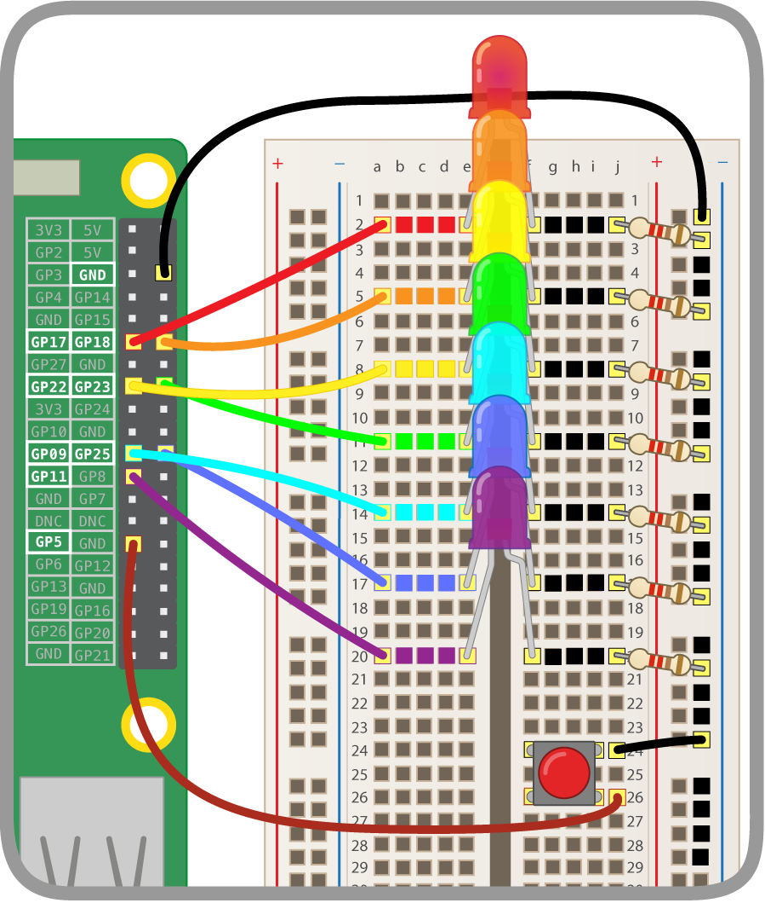

## Add a Button

You will now make your unicorn dance when the rainbow is flashing, by pressing a button!

### Connect the Button

+ Connect your button to the breadboard and GPIO

Here are instructions on how to connect a button to the Raspberry Pi:
However, instead of **GPIO 17** like below, we've used **GPIO 5** for the button because **GPIO 17** is taken by an LED.
[[[rpi-gpio-wiring-a-button]]]

Your rainbow should now look something like this:

### Code the Button

+ Configure your button in Scratch

[[[rpi-scratch-button]]]

### Control Rainbow Unicorn Dance

You can control your rainbow and unicorn by pressing a button.

You should now have 3 different chunks of code in Scratch:
1) Unicorn dancing code
2) GPIO blinking rainbow code
3) Button configuring code

+ Delete all of the `say ___`{:class="blocklooks"} blocks in your button configuring code (from the last step), and then duplicate the code.

+ For your unicorn dancing code, delete `when flag clicked`{:class="blockevents"} block and slot the rest of the unicorn dancing code into `else`{:class="blockcontrol"} of the button configuring code.

+ For your GPIO blinking rainbow code, delete the `when flag clicked`{:class="blockevents"} block and slot the rest of the GPIO blinking rainbow code into `else`{:class="blockcontrol"} of the other button configuring code.

+ In the `if`{:class="blockcontrol"} slots of your code, add an action. I suggest `switch costume to first costume`{:class="blocklooks"} so your unicorn doesn't get its dance moves mixed up.

--- hints ---
--- hint ---
If pressing the button doesn't make your rainbow light, and unicorn dance, try:
1) Making sure everything is connecting to the right GPIO
2) Making sure you've got inputs and outputs right
3) Making sure timings match for your two chunks of code
4) Double checking your code
--- /hint ---
--- /hints ---

--- challenge ---

+ Have some fun with your dancing unicorn rainbow

--- collapse ---

---
title: Dancing Unicorn Rainbow Challenges
---

Ideas:
1) Make your rainbow blink and unicorn dance faster.
2) Teach your unicorn a new dance (play around with costumes and speeds).
3) Add more buttons to make the unicorn do different dances.
4) Add more `events`{:class="blockevents"} to make the unicorn do different dances.
5) Make a game with your rainbow and dancing unicorn.

--- /collapse ---

--- /challenge ---
