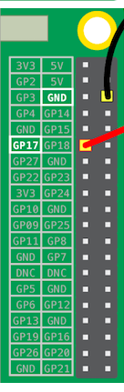

## Test your circuit in Scratch

You will now connect your circuit and first rainbow colour to Scratch, so that you can code a Scratch program to control the LED.

--- task ---
Open up Scratch 3 on your Raspberry Pi.


--- /task ---

--- task ---
Then add the Raspberry Pi Simple Electronics extension


--- /task ---

--- task ---
In the previous step, you connected your LED to pin **3V3**. This is the pin to connect to if you are testing your LED. You now need to connect your LED to a pin you can control with Scratch. Move the wire from pin **3V3** to a new pin, for example **GPIO 17**.
--- /task ---



--- task ---
Now test that the LED can be controlled using the following simple script

```blocks3
when flag clicked
turn LED (17 v) [on v] ::extension
wait (1) secs
turn LED (17 v) [off v] ::extension
```
--- /task ---

--- task ---
Click the green flag to run your script. The LED should turn on for 1 second.
--- /task ---
