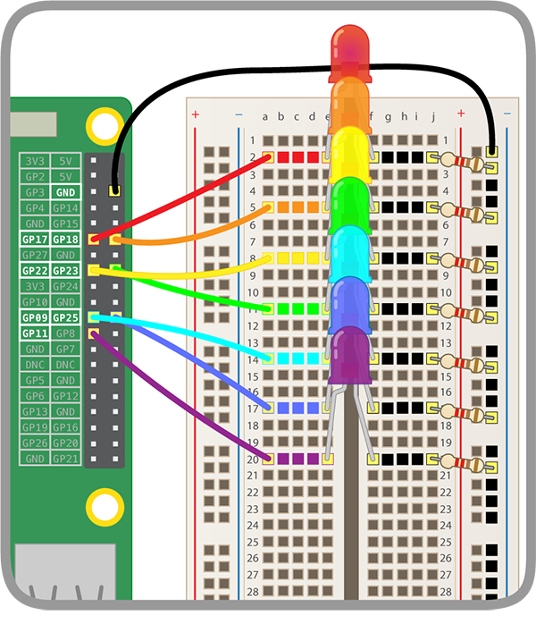

## Build Your Rainbow

You are now ready to create an awesome rainbow! In this step, you will assemble your rainbow and program the LEDs to blink in a rainbow pattern.

+ Find all the LEDs you are going to use and make sure you also have the same amount of jumper wires and resistors

+ Rearrange the circuit you already have to make room for other colours of the rainbow.

### Ground the Rainbow

+ Use one **ground** for all of your LEDs

To make sure your rainbow shines brightly and is not covered by too many jumper wires, each LED must share one ground.

The breadboard looks like this inside:

To ground the whole rainbow with one jumper wire:
+ Connect the jumper wire attached to **GND** to a breadboard *rail*.
+ Make sure resistors connect the same *rail* as the ground jumper wire and to the same *bar* as the LED:

### Complete the Rainbow

+ Add the rest of your LEDs, LED jumper wires, and resistors to the breadboard in a colour arrangement of your choice.

Make sure to leave room for a button at the end.
It will help to use the same colour jumper wire as your LED if you are using many different colours.

Your rainbow should look similar to this one:

