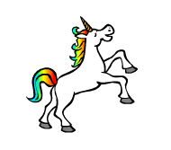
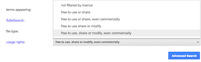
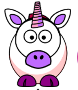
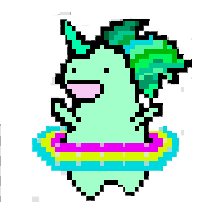

## Make a Unicorn Dance to your Rainbow

In this step, you will program a unicorn to dance in Scratch to the rhythm of your rainbow.
You will use a button to program your rainbow and dancing unicorn.

---

+ Either (1) change to the scratch unicorn sprite; (2) upload a unicorn sprite from somewhere else, or; (3) draw your own unicorn sprite in Scratch or another program (like the lovely green unicorn on the right):

| (1) Scratch Sprite:                          | (2) Upload your own:                         | (3) Draw your own:                           |
| :------------------------------------------: | :------------------------------------------: | :------------------------------------------: |
| | | |

---
Click for a reminder on how to draw sprites in Scratch:
[[[generic-scratch-draw-sprite]]]

---

+ Decide how many costumes you want your unicorn sprite to have for the dance, and edit your costumes accordingly.

It is up to you how many costumes you want to add for your dancing unicorn. For this dancing green unicorn, we have used 5 costumes:

|      |       |

---
Click for a reminder on how to change costumes in Scratch:
[[[generic-scratch-add-costume]]]

---

+ Use Scratch to program your unicorn's dance

Create a `forever loop`{:class="blockcontrol"} and have your unicorn switch costumes with `next costume`{:class="blocklooks"}

Unicorns are generally good dancers, so make sure you time your unicorn's dance to match the speed of your rainbow.
You can do this using the `wait`{:class="blockcontrol"} block

Challenge?
Add whole code in a hint?
