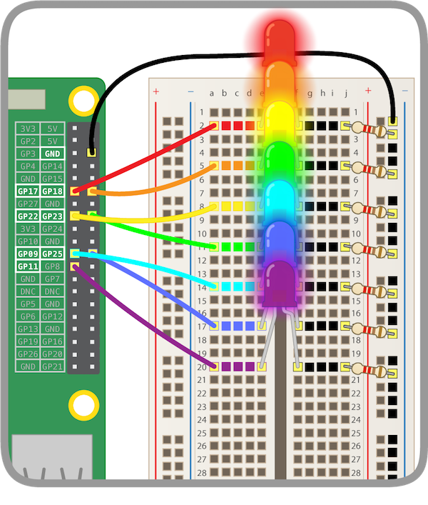

## Light the Rainbow

Test your rainbow in Scratch by lighting the whole rainbow at once

+ Add more code to control the other LEDs. Make sure you have the GPIO Pins selected

Your rainbow should light up like this:



--- hints ---
--- hint ---
Add more `set gpio () to output high`{:class="blockmoreblocks"} blocks at the end of this code:
```blocks  
	when flag clicked
	set gpio (17) to [output high v] :: extension
```
--- /hint ---
--- hint ---
Keep adding blocks to the bottom until all your GPIO pins are set to ``output high``
```blocks  
	when flag clicked
	set gpio (17) to [output high v] :: extension
  set gpio (18) to [output high v] :: extension
  set gpio (22) to [output high v] :: extension
```
--- /hint ---
--- hint ---

If your LEDs are not lighting:

1) Make sure you look at which GPIO your LEDs are connected to and have set them in Scratch to `output high`{:class="blockmoreblocks"}
2) Check that the LED is working (you can plug the LED's jumper wire into **GPIO 3V3** to test)
3) Make sure the circuit on the breadboard is complete.

--- /hint ---
--- /hints ---

+ Make the rainbow blink in a rainbow pattern

<video width="560" height="315" controls>
<source src="resources/Scratch-GPIO-Pathways-5.mp4" type="video/mp4">
Your browser does not support the video tag, try FireFox or Chrome
</video>

--- hints ---
--- hint ---

If you're stuck, make sure you are using the
`set gpio to output low`{:class="blockmoreblocks"} block, and the
`wait _ secs`{:class="blockcontrol"} block

--- /hint ---
--- hint ---

Try using this approach:
`when greenflag clicked`{:class="blockevents"}
`set gpio 17 to output high`{:class="blockmoreblocks"}
`wait _ secs`{:class="blockcontrol"} block
`set gpio 17 to output low`{:class="blockmoreblocks"}
`set gpio 18 to output high`{:class="blockmoreblocks"}
`wait _ secs`{:class="blockcontrol"} block
`set gpio 18 to output low`{:class="blockmoreblocks"}
`set gpio 22 to output high`{:class="blockmoreblocks"}
...

--- /hint ---
--- hint ---

To make the blinking lights keep circling through the rainbow, use a `forever`{:class="blockcontrol"} loop block around your code

--- /hint ---
--- /hints ---

--- challenge ---

+ Make the rainbow blink in a pattern of your choice.

--- collapse ---

---
title: Rainbow Challenges
---

Ideas:
  1) Make the rainbow go very fast and very slow
  2) Make all LEDs in the rainbow blink together
  3) Make pairs of LEDs light in alternate patters
  4) Make the rainbow blink something in Morse Code
  5) Make the rainbow do different things on different events

--- /collapse ---
--- /challenge ---
