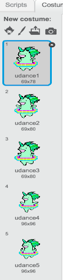

## Make a Unicorn Dance to your Rainbow

In this step, you will program a unicorn to dance in Scratch to the rhythm of your rainbow.
You will use a button to program your rainbow and dancing unicorn.


### Unicorn Sprite

+ Either (1) change to the scratch unicorn sprite; (2) upload a unicorn sprite from somewhere else, or; (3) draw your own unicorn sprite in Scratch or another program (like the lovely green unicorn on the right).

Examples:

| (1) Scratch Sprite:                          | (2) Upload your own:                         | (3) Draw your own:                           |
| :--------------------------------------------------: | :--------------------------------------------------: | :--------------------------------------------------: |
| |         |       |

---
(1) Instructions on choosing a Scratch sprite:
[[[generic-scratch-sprite-from-library]]]

(2) Instructions on finding your own image and uploading it:

Find images that you have permission to use.
[[[images-permissions-to-use]]]

Upload image to Scratch.
[[[generic-scratch-add-sprite-from-file]]]

(3) Instructions on drawing your own sprites:
Click for a reminder on how to draw sprites in Scratch:
[[[generic-scratch-draw-sprite]]]


### Unicorn Costumes

Your unicorn needs costumes to be able to dance. A costume is one out of a set of "frames" or alternate appearances of a sprite. Sprites can change their look by changing costumes, and costumes are often used to make an animation. Here, we will be creating a dancing unicorn animation, so each costume will represent a movement from your unicorn.

+ Decide how many costumes you want your unicorn sprite to have for the dance, and edit your costumes accordingly.

Click for a reminder on how to add costumes in scratch
[[[generic-scratch-add-costume]]]

Click for a reminder on how to duplicate costumes in scratch
[[[generic-scratch-duplicate-costumes]]]

It is up to you how many costumes you want to add for your dancing unicorn. For this dancing green unicorn, we have used 5 costumes:

|      |       |

---


### Unicorn Dance

To create your animation, and switch between costumes, you need to program the unicorn to switch costumes with scratch blocks.

+ Switch between the first two costumes to start the unicorn dance.

Can you demo how to have it switch between the 1st and 2nd costumes with a wait in between, and let them continue and take care of the other costumes
In the hint, give them a hint before telling them the answer!

To switch from the first to the second costume use:
```blocks  
  switch costume to [costume 2 v]
```

Unicorns are generally good dancers, so make sure you time your unicorn's dance to match the speed of your rainbow. You can use the `wait`{:class="blockcontrol"} block, but make sure the wait time matches your rainbow wait time.
```blocks  
  wait (0.5) secs
  switch costume to [costume 2 v]
```

+ To create your dancing unicorn, switch between all costumes continuously.

Figure out what loop you need and how to switch easily between costumes.


--- hints ---
--- hint ---

Use a forever loop:
```blocks
  forever
```

--- /hint ---
--- hint ---

Use this block to switch to the next costume each time you go through the loop:
```blocks
  next costume
```

--- /hint ---
--- hint ---

Your code should look like this:
```blocks
  forever
  wait (0.5) secs
  next costume
```

--- /hint ---
--- /hints ---
