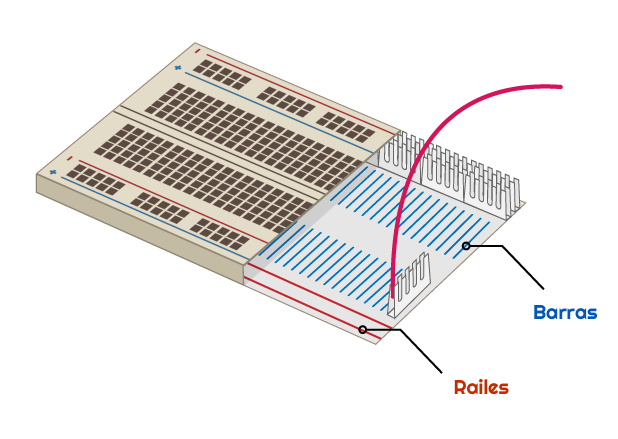

## Construye tu arcoiris

En este paso, montarás tu arcoiris y programarás sus LEDs para que parpadeen en un patrón de arcoiris.

--- task --- Encuentra todos los LEDs que vas a usar, y asegúrate de tener el número correcto de cables puente y resistencias (uno de cada uno por LED). --- /task ---

--- task --- Reorganiza el circuito que ya tienes para hacer espacio para los otros colores de tu arcoiris. --- /task ---

### Conecta a tierra el arcoiris

--- task --- Para que tu arcoiris brille intensamente y no esté cubierto por demasiados cables puente, todos los LEDs deben compartir un pin **Tierra (GND)** pin. Puede configurarlos así reorganizando tus componentes en el panel.

La placa de pruebas se ve así por dentro:

Para conectar a tierra todo el arcoiris con un cable puente: --- /task ---

--- task --- Conecta el cable puente conectado a **GND** a un **rail** de la placa de pruebas --- /task ---

--- task --- Asegúrate de que las resistencias se conecten al mismo rail que el cable puente **GND** y a la misma **barra** que el LED al que pertenecen: --- /task ---

### Completa el arcoiris

--- task --- Añade el resto de tus LEDs, cables puente y resistencias a la placa de pruebas en un colorido arreglo de tu elección. Asegúrate de dejar espacio para un botón al final. --- /task ---

Si usas muchos colores diferentes, podría ayudar combinar el color de los cables puente con los LEDs.

Tu arcoiris debería ser similar a este:

