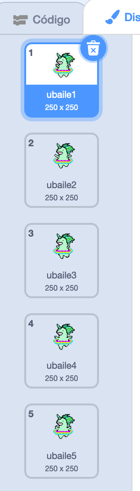

## Haz que un unicornio baile con tu arcoiris

En este paso, programarás un unicornio en Scratch que baila al ritmo de tu arcoiris. Utilizarás un botón para programar tu arcoiris y unicornio que baila.

### Objeto unicornio

Elige una de las siguientes opciones para crear un objeto de unicornio:

1. Usa el objeto unicornio de Scratch
2. Sube una imagen de unicornio desde otro lugar y úsala como tu objeto
3. Dibuja tu propio objeto unicornio en Scratch u otro programa (como el hermoso unicornio verde a la derecha).

Ejemplos:

|             (1) Objeto de Scratch:              |            (2) Sube el tuyo:            |               (3) Dibuja el tuyo:               |
|:-----------------------------------------------:|:---------------------------------------:|:-----------------------------------------------:|
|  |  |  |

--- task --- Si has elegido la opción 1, haz clic aquí: 
[[[generic-scratch3-sprite-from-library]]] 
--- /task ---

--- task --- Si has elegido la opción 2 porque quieres subir una imagen de un unicornio que encontraste en otro lugar, haz clic a continuación primero para aprender sobre los permisos de la imagen y luego utiliza las instrucciones en el segundo cuadro para subir tu archivo: 
[[[images-permissions-to-use]]]

[[[generic-scratch3-sprite-from-library]]] 
--- /task ---

--- task --- Si vas con la opción 3, haz clic abajo para obtener instrucciones sobre cómo dibujar tu propio unicornio en Scratch: 
[[[generic-scratch3-draw-sprite]]]
--- /task ---

### Disfraces de unicornio

Tu unicornio necesita **disfraces** para poder bailar. Un disfráz es uno de un conjunto de apariencias de un objeto, lo que significa que los objetos pueden cambiar su apariencia cambiando los disfraces. Por lo tanto, puedes usar disfraces para hacer que un objeto parezca que se está moviendo cuando quieras crear una animación.

Aquí crearemos una animación de un unicornio que baila, por lo que cada disfráz representará un movimiento de baile de tu unicornio.

--- task --- Decide cuántos disfraces quieres que tu objeto de unicornio tenga para el baile y edita tus disfraces en consecuencia.

Haz clic para un recordatorio sobre cómo añadir disfraces en Scratch: 
[[[generic-scratch3-add-costume]]]

Haz clic para obtener un recordatorio sobre cómo duplicar disfraces en Scratch: 
[[[generic-scratch3-duplicate-costumes]]] 
--- /task ---

Depende de ti cuántos disfraces quieres añadir para tu unicornio que baila. Para este unicornio verde que baila, hemos utilizado cinco disfraces:

|  |  |

### Baile de unicornio

Para crear tu animación de baile, necesitas programar el unicornio para que cambie de disfráz.

--- task --- Cambia entre los dos primeros disfraces para iniciar el baile del unicornio.

Para cambiar del primer al segundo disfráz usa:

```blocks3
switch costume to [costume 2 v]
```

Los unicornios son generalmente buenos bailarines, así que asegúrate de que tu unicornio se acerca a la velocidad de tu patrón de arcoiris. Puedes usar el bloque `esperar`{:class="blockcontrol"} para hacer coincidir el tiempo de espera del unicornio con el tiempo de espera de tu arcoiris.

```blocks3
wait (0.5) secs
switch costume to [costume 2 v]
```

--- /task ---

--- task --- Para crear tu unicornio que baila, cambia entre todos los disfraces continuamente. ¿Qué tipo de bucle necesitas para hacer esto? --- /task ---

--- hints ---
 --- hint ---

Usa un bucle para siempre:

```blocks3
por siempre
```

--- /hint --- --- hint ---

Usa este bloque para cambiar al siguiente disfraz cada vez que pases por el bucle:

```blocks3
next costume
```

--- /hint --- --- hint ---

Tu código debería verse así:

```blocks3
forever
wait (0.5) secs
next costume
```

--- /hint ------ /hints ---