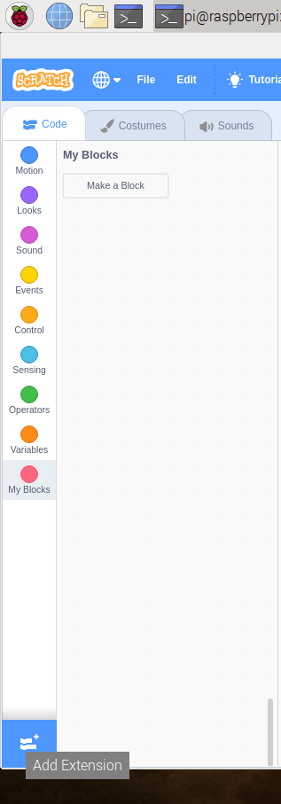

## Prueba tu circuito en Scratch

Ahora conectarás tu circuito y el primer color del arcoíris a Scratch, de modo que puedas crear un programa Scratch para controlar el LED.

\--- task \--- Abre Scratch 3 en tu Raspberry Pi.

 \--- /task \---

\--- task \--- Luego añade la extensión de Raspberry Pi Simple Electronics (electrónica-simple)



 \--- /task \---

\--- task \--- En el paso anterior, conectaste tu LED al pin **3V3**. Este es el pin al que te tienes que conectar si estás probando tu LED. Ahora necesitas conectar tu LED a un pin que puedes controlar con Scratch. Mueve el cable del pin **3V3** a un nuevo pin, por ejemplo **GPIO 17**. \--- /task \---


\--- task \--- Ahora prueba que el LED pueda ser controlado usando el siguiente script simple

```blocks3
when flag clicked
turn LED (17 v) [on v] ::extension
wait (1) secs
turn LED (17 v) [off v] ::extension
```

\--- /task \---

\--- task \--- Haz clic en la bandera verde para ejecutar tu script. El LED debería encenderse durante 1 segundo. \--- /task \---