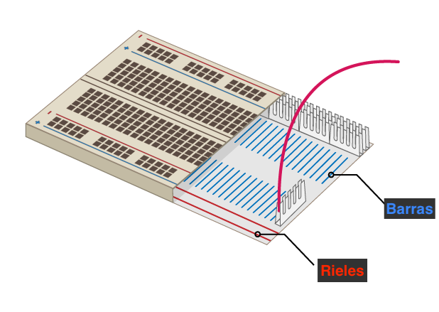

## Construye tu arcoíris

En este paso, ensamblarás tu arcoíris y programarás sus LEDs para parpadear en un patrón de arcoíris.

--- task --- Encuentra todos los LEDs que vas a usar, y asegúrate de tener el número correcto de cables de puente y resistencias (una por LED). --- /task ---

--- task --- Reorganiza el circuito que ya tienes para hacer espacio para los otros colores de tu arcoíris. --- /task ---

### Conecta el arcoíris a tierra

--- task --- Para que tu arcoíris brille intensamente y no esté cubierto por demasiados cables puente, todos los LEDs deben compartir un **Ground (GND)** pin. Puedes configurarlos así, reorganizando sus componentes en la placa de pruebas.

La placa de pruebas se ve así por dentro:

Para conectar a tierra todo el arcoíris con un cable de puente: --- /task ---

--- task --- Conecta el otro extremo del cable de puente conectado a **GND** a un **riel** de la placa de pruebas --- /task ---

--- task --- Asegúrate de que las resistencias se conecten al mismo riel que el cable de puente **GND** y a la misma **barra** que el LED al que pertenecen: --- /task ---

### Completa el arcoíris

--- task --- Añade el resto de tus LEDs, cables de puente y resistencias a la placa de pruebas en un arreglo de colores de tu elección. Asegúrate de dejar espacio para un botón al final. --- /task ---

Si usas muchos colores diferentes, puede ser útil hacer coincidir el color de los cables de puente con los LED.

Tu arcoíris debería ser similar a este:

