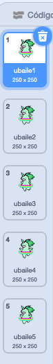

## Make a unicorn dance to your rainbow

In this step, you will program a unicorn in Scratch that dances to the rhythm of your rainbow. You will use a button to program your rainbow and dancing unicorn.

### Unicorn sprite

Choose one of the following options to create a unicorn sprite:

1. Use the Scratch unicorn sprite
2. Upload a unicorn image from somewhere else and use it as your sprite
3. Draw your own unicorn sprite in Scratch or another program (like the lovely green unicorn on the right).

Examples:

|              (1) Scratch sprite:               |          (2) Upload your own:           |              (3) Draw your own:              |
|:----------------------------------------------:|:---------------------------------------:|:--------------------------------------------:|
|  |  |  |

\--- task \--- Si has elegido la opción 1, haz clic aquí: [[[generic-scratch3-sprite-from-library]]] \--- /task \---

\--- task \--- Si has elegido la opción 2 porque quieres subir una imagen de unicornio que encontraste en otro lugar, haz clic a continuación para primero aprender sobre los permisos de las imágenes y luego utiliza las instrucciones en el segundo cuadro para subir tu archivo: [[[images-permissions-to-use]]]

[[[generic-scratch3-sprite-from-library]]] \--- /task \---

\--- task \--- If you're going with option 3, click below for instructions on how to draw your own unicorn in Scratch: [[[generic-scratch3-draw-sprite]]] \--- /task \---

### Unicorn costumes

Your unicorn needs **costumes** to be able to dance. Un disfraz es uno de los conjuntos de apariencias de un objeto, lo que significa que los objetos pueden cambiar su aspecto cambiando de disfraces. Therefore, you can use costumes to make a sprite look like it's moving whenever you want to create an animation.

Aquí crearemos una animación de unicornio bailando, por lo que cada disfraz representará un movimiento de baile de tu unicornio.

\--- task \--- Decide cuántos disfraces quieres que tu objeto de unicornio tenga para el baile, y edita tus disfraces pensando en esto.

Click for a reminder on how to add costumes in Scratch: [[[generic-scratch3-add-costume]]]

Click for a reminder on how to duplicate costumes in Scratch: [[[generic-scratch3-duplicate-costumes]]] \--- /task \---

It is up to you how many costumes you want to add for your dancing unicorn. For this dancing green unicorn, we have used five costumes:

|  |  |

### Unicorn dance

Para crear tu animación de baile, necesitas programar el unicornio para cambiar de disfraz.

\--- task \--- Switch between the first two costumes to start the unicorn dance.

To switch from the first to the second costume use:

```blocks3
switch costume to [costume 2 v]
```

Unicorns are generally good dancers, so make sure you time your unicorn's dance to the speed of your rainbow pattern. You can use the `wait`{:class="blockcontrol"} block to match the unicorn's wait time to your rainbow's wait time.

```blocks3
wait (0.5) secs
switch costume to [costume 2 v]
```

\--- /task \---

\--- task \--- To create your dancing unicorn, switch between all costumes continuously. What kind of loop do you need to do this? \--- /task \---

\--- hints \--- \--- hint \---

Usa un bucle para siempre:

```blocks3
por siempre
```

\--- /hint \--- \--- hint \---

Use this block to switch to the next costume each time you go through the loop:

```blocks3
next costume
```

\--- /hint \--- \--- hint \---

Your code should look like this:

```blocks3
forever
wait (0.5) secs
next costume
```

\--- /hint \--- \--- /hints \---