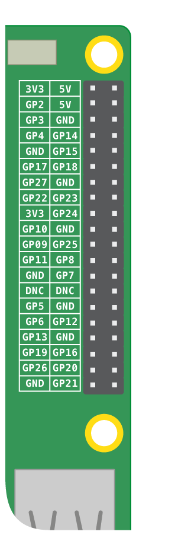

## L'atmosphère de ton arc-en-ciel

Avant de créer un arc-en-ciel, tu dois apprendre à le contrôler. Tu alimenteras et contrôleras ton arc-en-ciel à l'aide des broches **GPIO du Raspberry Pi**. GPIO est l'acronyme de **G**eneral **P**urpose **I**nput /**O**utput.

Les broches GPIO du Pi te permettent d'envoyer et de recevoir des signaux marche/arrêt vers et depuis des composants électroniques — par exemple des LEDs, des moteurs, des boutons et des buzzers.

Si tu regardes ton Pi avec les ports USB tournés vers toi, voici la disposition des broches : 

Un Raspberry Pi possède 26 broches GPIO. Dans l'image ci-dessus, ce sont les broches étiquetées avec GP et un nombre.

+ Pour en savoir un peu plus sur les broches GPIO, clique ici :

[[[rpi-gpio-pins]]]