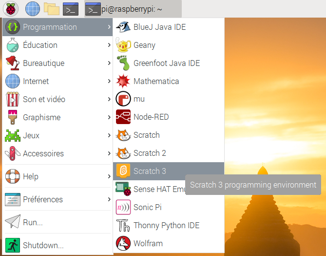
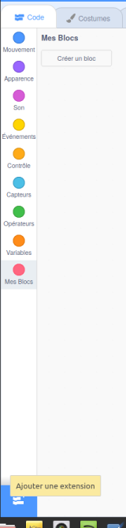
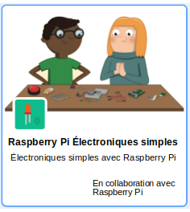

## Teste ton circuit dans Scratch

Tu vas maintenant connecter ton circuit et ta première couleur arc-en-ciel à Scratch, afin de pouvoir coder un programme Scratch pour contrôler la LED.

--- task ---
Ouvre Scratch 3 sur ton Raspberry Pi.

 
--- /task ---

--- task ---
Ajoute ensuite l'extension Raspberry Pi Simple Electronics



 
--- /task ---

--- task ---
Dans l'étape précédente, tu as connecté ta LED à la broche **3V3**. Il s'agit de la broche à laquelle te connecter si tu testes ta LED. Tu dois maintenant connecter ta LED à une broche que tu peux contrôler avec Scratch. Déplace le fil de la broche **3V3** vers une nouvelle broche, par exemple **GPIO 17**. --- /task ---


--- task ---
Teste maintenant que la LED peut être contrôlée en utilisant le script simple suivant

```blocks3
when flag clicked
turn LED (17 v) [on v] ::extension
wait (1) secs
turn LED (17 v) [off v] ::extension
```

--- /task ---

--- task ---
Clique sur le drapeau vert pour tester ton code. La LED devrait s'allumer pendant 1 seconde. --- /task ---