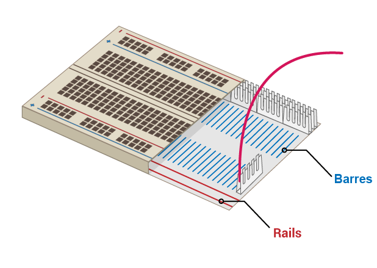
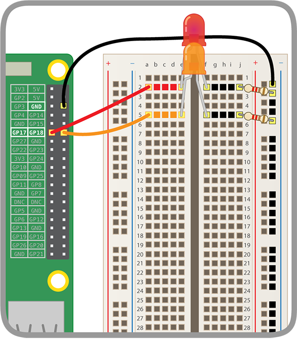

## Construis ton arc-en-ciel

Dans cette étape, tu vas assembler ton arc-en-ciel et programmer ses LEDs pour qu'elles clignotent en arc-en-ciel.

Trouve toutes les LEDs que tu vas utiliser et assure-toi que tu as également le bon nombre de fils de cavalier et de résistances (une par LED). --- /task ---

Réorganise le circuit que tu as déjà pour faire de la place aux autres couleurs de ton arc-en-ciel. --- /task ---

### Branchement à la masse de l'arc-en-ciel

Pour que ton arc-en-ciel brille de mille feux et ne soit pas recouvert par trop de fils de cavalier, toutes les LED doivent partager une broche de **masse (GND)**. Tu peux les configurer comme ceci en réorganisant un peu tes composants sur la platine d'expérimentation.

La platine d'expérimentation ressemble à ceci à l'intérieur:

Pour brancher à la masse tout l'arc-en-ciel avec un fil de cavalier:

Connecte le cavalier attaché à **GND** à un **rail** de la platine d'expérimentation

Assure-toi que les résistances sont connectées au même rail que le fil de cavalier **GND** et à la même **barre** en tant que LED à laquelle ils appartiennent: 

### Terminer l'arc-en-ciel

Ajoute le reste de tes LEDs, des fils de cavalier et des résistances à la platine d'expérimentation dans un arrangement de couleur de ton choix. Assure-toi de laisser de la place pour un bouton à la fin. --- /task ---

Si tu utilises de nombreuses couleurs différentes, il peut être utile de faire correspondre la couleur des fils de cavalier à tes LEDs.

Ton arc-en-ciel devrait ressembler à celui-ci:

