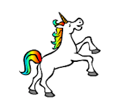

## Faire danser une licorne sur ton arc-en-ciel

Dans cette étape, tu vas programmer une licorne dans Scratch qui danse au rythme de ton arc-en-ciel. Tu utiliseras un bouton pour programmer ton arc-en-ciel et ta licorne dansante.

### Sprite de licorne

Choisis l'une des options suivantes pour créer un sprite licorne:

1. Utilise le sprite licorne Scratch
2. Télécharge une image de licorne trouvée autre part et utilise-la comme sprite
3. Dessine ton propre sprite de licorne dans Scratch ou dans un autre programme (comme la jolie licorne verte à droite).

Exemples:

|             (1) Sprite Scratch:              |      (2) Télécharge la tienne:       |             (3) Dessine la tienne:             |
|:---------------------------------------------:|:-------------------------------------:|:-----------------------------------------------:|
|  |  |  |

Si tu as choisi l'option 1, clique ici: [[[generic-scratch3-sprite-from-library]]]

Si tu as choisi l'option 2 parce que tu veux télécharger une image de licorne que tu as trouvée ailleurs, clique d'abord ci-dessous pour en savoir plus sur les autorisations d'image, puis utilise les instructions dans la deuxième case pour télécharger ton fichier: [[[images-permissions-to-use]]]

[[[generic-scratch3-sprite-from-library]]]

Si tu choisis l'option 3, clique ci-dessous pour savoir comment dessiner ta propre licorne dans Scratch: [[[generic-scratch3-draw-sprite]]]

### Costumes de licorne

Ta licorne a besoin de **costumes** pour pouvoir danser. Un costume fait partie d'un ensemble d'apparences d'un sprite, ce qui signifie que les sprites peuvent changer d'apparence en changeant de costume. Par conséquent, tu peux utiliser des costumes pour donner l'impression que le sprite bouge à chaque fois que tu souhaites créer une animation.

Ici, nous allons créer une animation de licorne dansante, donc chaque costume représentera un mouvement de danse de ta licorne.

Décide combien de costumes tu veux que ton sprite de licorne ait pour la danse, et édite tes costumes en conséquence.

Clique pour un rappel sur la façon d'ajouter des costumes dans Scratch: [[[generic-scratch3-add-costume]]]

Clique pour un rappel sur la façon de dupliquer les costumes dans Scratch: [[[generic-scratch3-duplicate-costumes]]]

C'est à toi de décider combien de costumes tu souhaites ajouter pour ta licorne dansante. Pour cette licorne verte dansante, nous avons utilisé cinq costumes:

|  |  |

### Danse de licorne

Pour créer ton animation de danse, tu dois programmer la licorne pour changer de costume.

Bascule entre les deux premiers costumes pour commencer la danse de la licorne.

Pour passer du premier au deuxième costume, utilise:

```blocks3
switch costume to [costume 2 v]
```

Les licornes sont généralement de bons danseuses, alors assure-toi de synchroniser la danse de ta licorne à la vitesse de ton motif arc-en-ciel. Tu peux utiliser le bloc `attendre`{:class="blockcontrol"} pour faire correspondre le temps d'attente de la licorne au temps d'attente de ton arc-en-ciel.

```blocks3
wait (0.5) secs
switch costume to [costume 2 v]
```

--- /task ---

Pour créer ta licorne dansante, bascule entre tous les costumes en continu. De quel type de boucle as-tu besoin pour faire cela? --- /task ---

--- hints ---
--- hint ---

Utilise une boucle répéter indéfiniment:

```blocks3
répéter indéfiniment
```

--- /hint --- 
--- hint ---

Utilise ce bloc pour passer au costume suivant à chaque fois que tu parcoures la boucle:

```blocks3
next costume
```

--- /hint --- --- hint ---

Ton code devrait ressembler à ceci:

```blocks3
forever
wait (0.5) secs
next costume
```

--- /hint ---
--- /hints ---