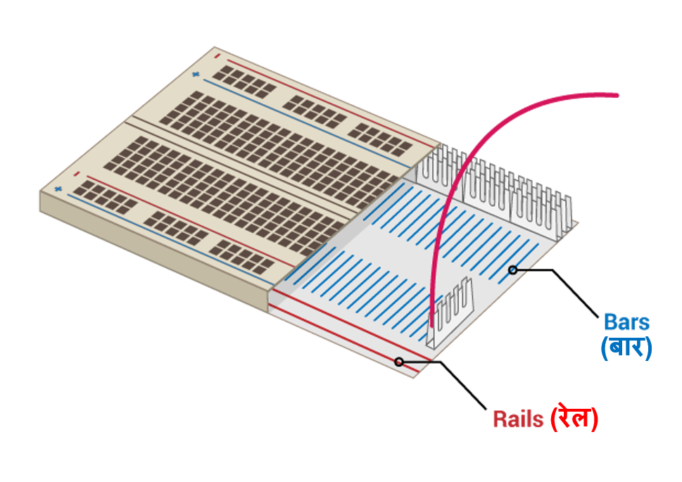

## अपना इंद्रधनुष बनाएं

इस चरण में, आप अपने इंद्रधनुष के LED को एक साथ जोड़ेंगे और इंद्रधनुष के पैटर्न में LED को बंद चालू करेंगे।

--- task --- उन सभी LED का पता लगाएं जिनका आप उपयोग करने जा रहे हैं, और सुनिश्चित करें कि आपके पास जम्पर वायर और रेसिस्टर की सही संख्या है (एक प्रति LED)। --- /task ---

--- task --- अपने इंद्रधनुष के अन्य रंगों के लिए जगह बनाने के लिए सर्किट को पुनर्व्यवस्थित (rearrange) करें। --- /task ---

### इंद्रधनुष के LED को ग्राउंड से जोड़े

--- task --- सभी LED एक ही **ग्राउंड (GND)** पिन का इस्तमाल करना चाहिए ताकि आपका इंद्रधनुष चमकता रहे और बहुत अधिक जम्पर वायर से ढका न रहें। आप अपने उपकरणों को थोड़ा-थोड़ा करके ब्रेडबोर्ड पर दोबारा लगाकर उन्हें इस तरह सेट कर सकते हैं।

ब्रेडबोर्ड अंदर से ऐसा दिखता है:

एक जम्पर वायर के साथ पूरे इंद्रधनुष को ग्राउंड करने के लिए: --- /task ---

--- task --- **GND** से जुड़े जम्पर वायर को ब्रेडबोर्ड के **रेल** से कनेक्ट करें --- /task ---

--- task --- सुनिश्चित करें कि रेसिस्टर को ब्रेडबोर्ड के रेल को उसी **GND** जंपर वायर और उसी LED के संबंधित **बार** से कनेक्ट करें --- /task ---

### इंद्रधनुष पूरा करें

--- task --- अपनी पसंदीदा रंग के व्यवस्था में ब्रेडबोर्ड में अपने बाकी LED, जम्पर वायर और रेसिस्टर को जोड़ें। अंत में एक बटन के लिए जगह छोड़ना सुनिश्चित करें। --- /task ---

यदि आप कई अलग-अलग रंगों का उपयोग कर रहे हैं, तो आप LED के जम्पर वायर उसी LED के रंग से मेल खाने वाले रख सकते हैं।

आपका इंद्रधनुष कुछ इस तरह दिखना चाहिए:

