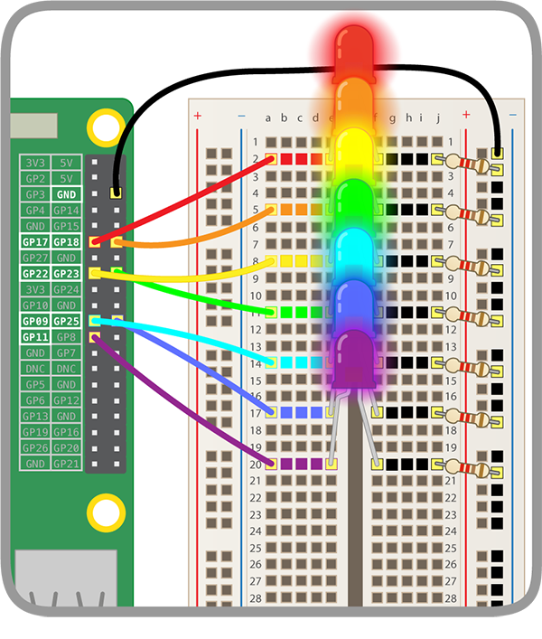

## अपने इंद्रधनुष को रोशन करें

यह सुनिश्चित करने के लिए कि आपका इंद्रधनुष काम कर रहा है, आप पहले एक बार में पूरे इंद्रधनुष को रोशन करके इसका परीक्षण करेंगे। आप अपने इंद्रधनुष के LED कों एक के बाद एक बंद चालू करने और अपके पसंदीदा पैटर्न में रोशन करने के लिए कोड लिखेंगे।

\--- task \--- अन्य LED को नियंत्रित करने के लिए अधिक कोड जोड़ें। सुनिश्चित करें कि आप सही GPIO पिन शामिल करते हैं। \--- /task \---

अपने इंद्रधनुष कुछ इस तरह रोशन होना चाहिए:



\--- hint \--- \--- hint \--- अधिक `turn LED (0 v) [on v]`{:class="block3extensions"} ब्लॉक को इस कोड में जोड़े:

```blocks3
when flag clicked
turn LED (17 v) [on v] ::extension
```

\--- /hint \--- \--- hint \--- अपने कोड के निचले भाग पर ब्लॉक जोड़ते रहें जब तक कि आपके सभी LED `on`{:class="block3extensions"} पर सेट न हो जाएं।

```blocks3
when flag clicked
turn LED (17 v) [on v] ::extension
turn LED (18 v) [on v] ::extension
turn LED (22 v) [on v] ::extension
```

\--- /hint \--- \--- hint \---

यदि आपके LED रोशन नहीं हो रही हैं:

1) जाँच करें कि आपके LED किन GPIO पिन से जुड़े हैं, और सुनिश्चित करें कि आपने उन्हें `on`{:class="block3extensions"} पर सेट किया है। 2) परीक्षण करें कि क्या LED काम कर रहे हैं - इसके लिए आप एक LED के जम्पर वायर को **GPIO 3V3** में डाल कर इसका परीक्षण कर सकते हैं। 3) सुनिश्चित करें कि ब्रेडबोर्ड पर सर्किट पूरा हो गया है।

\--- /hint \--- \--- /hints \---

\--- task \--- अब, इस तरह से इंद्रधनुष पैटर्न में इंद्रधनुष के LED चालू बंद करने के लिए अधिक कोड जोड़ें:<video width="560" height="315" controls> <source src="resources/Scratch-GPIO-Pathways-5.mp4" type="video/mp4"> आपका ब्राउज़र वीडियो का समर्थन नहीं करता है, FireFox या Chrome आज़माएँ </video> 

ऐसा करने के लिए, आपको कुछ सेकंड के लिए एक LED चालू करना होगा और फिर अगले LED चालू होने पर उसी समय पहले LED को बंद करना होगा। \--- /task \---

\--- hints \--- \--- hint \---

सुनिश्चित करें कि आपका `Events`{:class="blockevents"} ब्लॉक आप परीक्षण करने के लिए जो कोड कर रहे हैं उससे मेल खाता है। इस उदाहरण में, हमारे इंद्रधनुष को चालू करने के लिए, हमें हरे झंडे पर क्लिक करना होगा:

```blocks3
when flag clicked
```

\--- /hint \--- \--- hint \---

यदि आप फंस गए हैं, तो सुनिश्चित करें कि आप इन ब्लॉकों का उपयोग कर रहे हैं:

```blocks3
turn LED (0 v) [off v] ::extension
wait () secs
```

\--- /hint \--- \--- hint \---

इस तरीके का उपयोग करके देखें:

```blocks3
when flag clicked
turn LED (17 v) [on v] ::extension
wait (0.5) secs
turn LED (17 v) [off v] ::extension
turn LED (18 v) [on v] ::extension
wait (0.5) secs
turn LED (18 v) [off v] ::extension
turn LED (22 v) [on v] ::extension
```

आपको अपने सभी LED के लिए ब्लॉक जोड़ने होंगे और यह सुनिश्चित करने की आवश्यकता होगी कि आप अपने कोड में सही GPIO पिन नंबर का उपयोग कर रहे हैं।

\--- /hint \--- \--- /hints \---

\--- task \--- एक लूप के माध्यम से इंद्रधनुष को बार बार बंद चालू करें।

हमेशा के लिए इंद्रधनुष पैटर्न को लूप करने के लिए, उपयोग करें:

```blocks3
forever
```

\--- /task \---

\--- challenge \---

+ अपनी पसंद के पैटर्न में इंद्रधनुष को बंद चालू करें।

## \--- collapse \---

## title: Rainbow challenges

Try out the following ideas:

1) Make the LEDs blink very fast and very slow 2) Make the whole rainbow blink 3) Make pairs of LEDs light up in alternate patterns 4) Make the rainbow blink something in Morse code 5) Make the rainbow do different things in response to different events

\--- /collapse \--- \--- /challenge \---