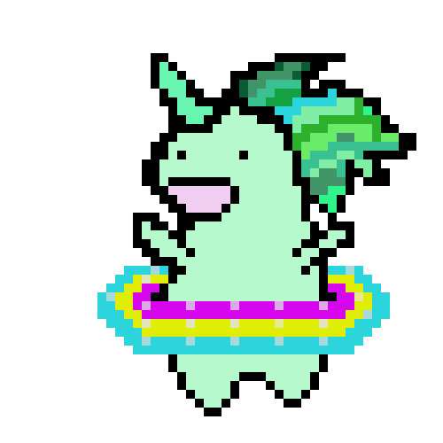
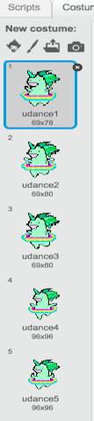

## अपने इंद्रधनुष के लिए एक काल्पनिक जानवर को नचाए

इस चरण में, आप Scratch में एक काल्पनिक जानवर को प्रोग्राम करेंगे जो आपके इंद्रधनुष के ताल पर नृत्य करता है। आप अपने इंद्रधनुष और नाचने वाले काल्पनिक जानवर को प्रोग्राम करने के लिए एक बटन का उपयोग करेंगे।

### काल्पनिक जानवर का sprite

काल्पनिक जानवर स्प्राइट बनाने के लिए निम्नलिखित विकल्पों में से एक चुनें:

1. Scratch के काल्पनिक जानवर स्प्राइट का उपयोग करें
2. कहीं और से एक काल्पनिक जानवर की छवि अपलोड करें और इसे अपने स्प्राइट के रूप में उपयोग करें
3. Scratch या किसी अन्य प्रोग्राम में अपने स्वयं का काल्पनिक जानवर स्प्राइट को ड्रा (draw) करें (जैसे दाईं ओर का प्यारा सा हरा काल्पनिक जानवर)।

उदाहरण:

|              (1) Scratch sprite:              |      (2) अपना खुद का अपलोड करें:      |       (३) अपना खुद का ड्रा करें:        |
|:---------------------------------------------:|:-------------------------------------:|:---------------------------------------:|
|  |  |  |

--- task --- यदि आपने विकल्प 1 को चुना, तो यहां क्लिक करें: 
[[[generic-scratch3-sprite-from-library]]] 
--- /task ---

--- task --- यदि आपने विकल्प 2 को चुना है क्योंकि आप एक काल्पनिक जानवर की छवि अपलोड करना चाहते हैं जो आपको कहीं और मिली है, तो छवि को इस्तमाल करने के अनुमति के बारे में जानने के लिए पहले नीचे क्लिक करें, और फिर अपनी फ़ाइल अपलोड करने के लिए दूसरे बॉक्स में दिए गए निर्देशों का उपयोग करें: 
[[[images-permissions-to-use]]]

[[[generic-scratch3-sprite-from-library]]] 
--- /task ---

--- task --- यदि आप विकल्प 3 के साथ जा रहे हैं, तो Scratch में अपना स्वयं का काल्पनिक जानवर कैसे ड्रॉ करना है, इस पर निर्देशों के लिए नीचे क्लिक करें: 
[[[generic-scratch3-draw-sprite]]] 
--- /task ---

### काल्पनिक जानवर के कॉस्ट्यूम्स

आपके गेंडा को नाचने के लिए **costumes** की आवश्यकता होगी। कॉस्ट्यूम स्प्राइट के एक दिखावे के सेट में से एक है, जिसका अर्थ है कि स्प्राइट अपना कॉस्ट्यूम बदलकर अपना रूप बदल सकते हैं। इसलिए जब आप एक एनीमेशन बनाना चाहते हैं, तो आप स्प्राइट के कॉस्ट्यूम का उपयोग कर सकते हैं।

यहां, हम एक नाचने वाला काल्पनिक जानवर का एनीमेशन बना रहे हैं, इसलिए प्रत्येक कॉस्ट्यूम आपके काल्पनिक जानवर की एक नृत्य चाल का प्रतिनिधित्व करेगी।

--- task --- तय करें कि आप अपनी स्प्राइट के नृत्य लिए कितने कॉस्ट्यूम चाहते हैं, और उसी के अनुसार कॉस्ट्यूम्स को संपादित करें।

Scratch में कॉस्ट्यूम जोड़ने के तरीके को फिर से देखने के लिए क्लिक करें: 
[[[generic-scratch3-add-costume]]]

Scratch में कॉस्ट्यूम की प्रतिलिपि बनाने के तरीके को फिर से देखने के लिए क्लिक करें: 
[[[generic-scratch3-duplicate-costumes]]] 
--- /task ---

यह आपके ऊपर है कि आप अपने नाचने वाले काल्पनिक जानवर के लिए कितने कॉस्ट्यूम जोड़ना चाहते हैं। इस नाचने वाले हरे काल्पनिक जानवर के लिए हमने पाँच कॉस्ट्यूम्स का उपयोग किया है:

|  |  |

### काल्पनिक जानवर का नृत्य

नाचने के एनीमेशन को बनाने के लिए, आपको कॉस्टयूम्स को बदलने के लिए अपने काल्पनिक जानवर को प्रोग्राम करना होगा।

--- task --- काल्पनिक जानवर का नृत्य शुरू करने के लिए पहले कॉस्ट्यूम को दूसरे से बदले।

पहली कॉस्ट्यूम को दूसरी कॉस्ट्यूम से बदलने के लिए इसतेमाल करें:

```blocks3
switch costume to [costume 2 v]
```

आपके काल्पनिक जानवर आम तौर पर अच्छे नर्तक होने चाहिए, इसलिए सुनिश्चित करें कि आप अपने इंद्रधनुष पैटर्न के गति से अपने काल्पनिक जानवर को समय दें। आप अपने काल्पनिक जानवर के प्रतीक्षा समय को आपके इंद्रधनुष के प्रतीक्षा समय से मिलाने के लिए `wait`{:class="blockcontrol"} ब्लॉक का उपयोग कर सकते हैं।

```blocks3
wait (0.5) secs
switch costume to [costume 2 v]
```

--- /task ---

--- task --- अपना नाचने वाला काल्पनिक जानवर बनाने के लिए, सभी कॉस्ट्यूम को लगातार बदलें। आपको ऐसा करने के लिए किस तरह के लूप की आवश्यकता होगी? --- /task ---

--- hints ---
 --- hint ---

forever लूप का उपयोग करें:

```blocks3
forever
```

--- /hint --- --- hint ---

लूप के माध्यम से हर बार अगली कॉस्ट्यूम पर जाने के लिए इस ब्लॉक का उपयोग करें:

```blocks3
next costume
```

--- /hint --- --- hint ---

आपका कोड इस प्रकार दिखना चाहिए:

```blocks3
forever
wait (0.5) secs
next costume
```

--- /hint ------ /hints ---