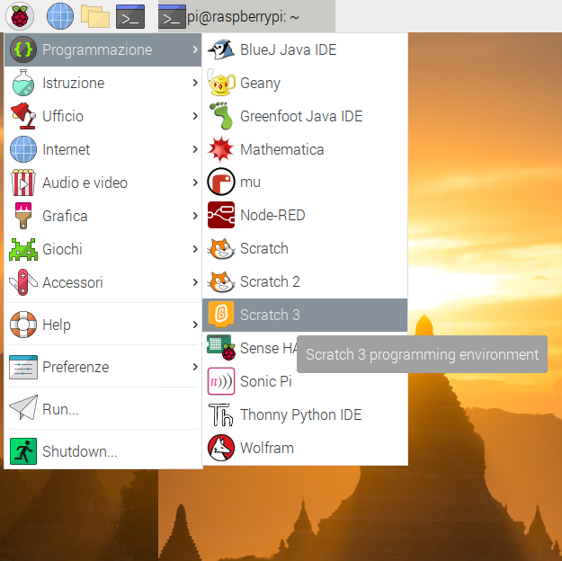
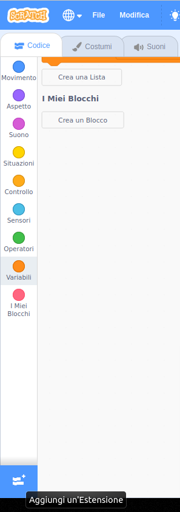

## Prova il tuo circuito in Scratch

Ora connetterai il tuo circuito e il primo colore dell'arcobaleno a Scratch, così potrai creare un programma Scratch per controllare il LED.

\--- task \--- Apri Scratch 3 sul tuo Raspberry Pi.

 \--- /task \---

\--- task \--- Poi aggiungi l'estensione Raspberry Pi Simple Electronics



 \--- /task \---

\--- task \--- Nel passaggio precedente, hai collegato il tuo LED al pin **3V3**. Questo è il pin a cui connetterti se stai testando il tuo LED. Ora devi collegare il LED a un pin che puoi controllare con Scratch. Sposta il cavo dal pin **3V3** a un nuovo pin, ad esempio **GPIO 17**. \--- /task \---


\--- task \--- Ora verifica che il LED possa essere controllato usando questo semplice script

```blocks3
when flag clicked
turn LED (17 v) [on v] ::extension
wait (1) secs
turn LED (17 v) [off v] ::extension
```

\--- /task \---

\--- task \--- Clicca sulla bandiera verde per eseguire il tuo script. Il LED dovrebbe accendersi per 1 secondo. \--- /task \---