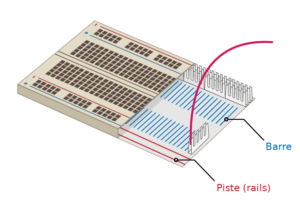

## Costruisci il tuo arcobaleno

In questo passaggio, assemblerai il tuo arcobaleno e programmerai i suoi LED per lampeggiare in un motivo arcobaleno.

\--- task \--- Trova tutti i LED che intendi utilizzare e assicurati di avere anche il giusto numero di cavi jumper e resistori (uno ciascuno per LED). \--- /task \---

\--- task \--- Riorganizza il circuito che hai già per fare spazio agli altri colori del tuo arcobaleno. \--- /task \---

### Metti a terra l'arcobaleno

\--- task \--- Per far sì che il tuo arcobaleno splenda e non sia coperto da troppi cavi jumper tutti i LED dovrebbero condividere un unico pin **Terra (GND)**. Puoi impostarli in questo modo riorganizzando un po' i tuoi componenti sulla breadboard.

La breadboard si presenta così all'interno:

Per mettere a terra l'intero arcobaleno con un solo ponticello: \--- /task \---

\--- task \--- Collega il cavo jumper collegato a **GND** su una **rail (pista)** della breadboard \--- /task \---

\--- task \--- Assicurati che i resistori si colleghino alla stessa pista del cavo jumper **GND** e alla stessa **barra** del LED a cui appartengono: \--- /task \---

### Completa l'arcobaleno

\--- task \--- Aggiungi il resto dei tuoi LED, cavi jumper e resistori alla breadboard in una disposizione di colori a tua scelta. Assicurati di lasciare spazio per un pulsante alla fine. \--- /task \---

Se stai utilizzando molti colori diversi, potrebbe essere utile abbinare il colore dei cavi jumper ai LED.

Il tuo arcobaleno dovrebbe assomigliare a questo:

