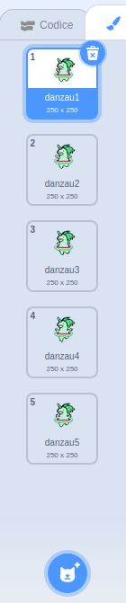

## Fai danzare un unicorno col tuo arcobaleno

In questo passaggio, programmerai un unicorno in Scratch che balla al ritmo del tuo arcobaleno. Utilizzerai un pulsante per programmare il tuo arcobaleno e l'unicorno danzante.

### Lo sprite unicorno

Scegli una delle seguenti opzioni per creare uno sprite unicorno:

1. Usa lo sprite dell'unicorno di Scratch
2. Carica un'immagine di unicorno e usala come sprite
3. Disegna il tuo sprite unicorno in Scratch o in un altro programma (come l'adorabile unicorno verde sulla destra).

Esempi:

|              (1) Sprite Scratch:               |           (2) Carica il tuo:           |             (3) Disegna il tuo:             |
|:----------------------------------------------:|:--------------------------------------:|:-------------------------------------------:|
|  |  |  |

--- task --- Se hai scelto l'opzione 1, fai clic qui: 
[[[generic-scratch3-sprite-from-library]]] 
--- /task ---

--- task --- Se hai scelto l'opzione 2 perché vuoi caricare un'immagine di unicorno che hai trovato da qualche altra parte, fai clic prima qui sotto per alcune informazioni riguardo ai permessi d'utilizzo delle immagini e al copyright, quindi usa le istruzioni nella seconda casella per caricare il tuo file: 
[[[images-permissions-to-use]]]

[[[generic-scratch3-sprite-from-library]]] 
--- /task ---

--- task --- Se preferisci l'opzione 3, clicca qui sotto per istruzioni su come disegnare il tuo unicorno in Scratch: 
[[[generic-scratch3-draw-sprite]]] 
--- /task ---

### Costumi per l'unicorno

Il tuo unicorno ha bisogno di **costumi** per poter ballare. Un costume è una di una serie di immagini di uno sprite, il che significa che gli sprite possono cambiare il loro aspetto cambiando i costumi. Pertanto, puoi usare i costumi per far sembrare che uno sprite si stia muovendo ogni volta che vuoi creare un'animazione.

Qui creeremo un'animazione di un unicorno danzante, in cui ogni costume rappresenterà un movimento di danza del tuo unicorno.

--- task --- Decidi quanti costumi vuoi che lo sprite dell'unicorno abbia per la danza e modifica i costumi di conseguenza.

Clicca per un promemoria su come aggiungere i costumi in Scratch: 
[[[generic-scratch3-add-costume]]]

Clicca per un promemoria su come duplicare i costumi in Scratch: 
[[[generic-scratch3-duplicate-costumes]]] 
--- /task ---

Sta a te decidere quanti costumi vuoi aggiungere per il tuo unicorno danzante. Per questo unicorno verde danzante abbiamo usato cinque costumi:

|  |  |

### Danza unicorno

Per creare l'animazione del ballo, devi programmare l'unicorno per cambiare costume.

--- task --- Passa da un costume all'altro per iniziare a far ballare l'unicorno.

Per passare dal primo al secondo costume usa:

```blocks3
switch costume to [costume 2 v]
```

Gli Unicorni sono generalmente dei bravi ballerini, quindi assicurati che il ballo del tuo unicorno abbia la stessa velocità del tuo arcobaleno. Puoi usare il blocco `attendi`{:class="blockcontrol"} per sincronizzare l'attesa dell'unicorno al tempo di attesa del tuo arcobaleno.

```blocks3
wait (0.5) secs
switch costume to [costume 2 v]
```

--- /task ---

--- task --- Per creare il tuo unicorno danzante, passa continuamente da un costume all'altro. Che tipo di ciclo ti serve per farlo? --- /task ---

--- hints ---
 --- hint ---

Usa un ciclo "per sempre":

```blocks3
forever
```

--- /hint --- --- hint ---

Usa questo blocco per passare al costume successivo ogni volta che passi attraverso il ciclo:

```blocks3
next costume
```

--- /hint --- --- hint ---

Il tuo codice dovrebbe apparire così:

```blocks3
forever
wait (0.5) secs
next costume
```

--- /hint ------ /hints ---