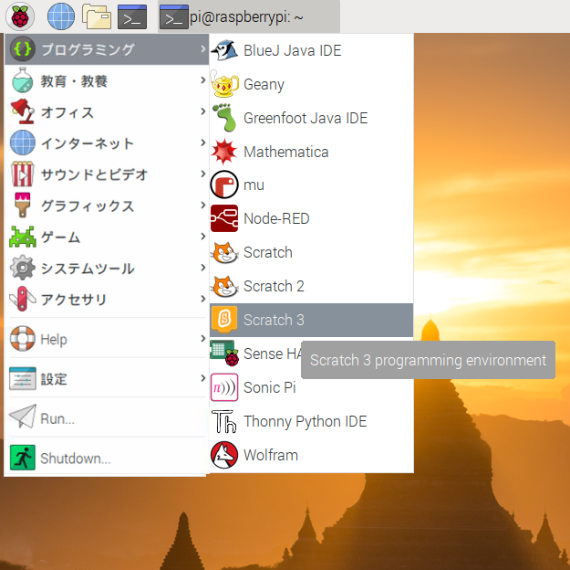
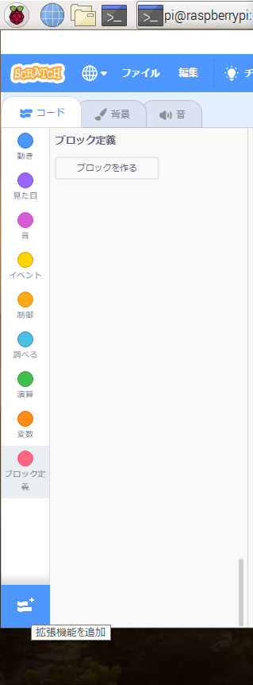

## Scratchで回路をテストする

次に、回路と虹色の1つ目のLEDをScratchに接続し、ScratchプログラムをコーディングしてLEDを制御できるようにします。

\--- task \--- Raspberry PiでScratch 3を開きます。

 \--- /task \---

\--- task \--- 次にRaspberry Pi Simple エレクトロニクス拡張機能を追加します



 \--- /task \---

\--- task \--- 前のステップで、LEDを**3V3**ピンに接続しました 。 これは、LEDをテストする場合に接続するピンです。 今度は、Scratchで制御できるピンにLEDを接続する必要があります。 ジャンパー線を**3V3**ピンから**GPIO 17**などの 新しいピンに移動します。 \--- /task \---


\--- task \--- 次の簡単なスクリプトを使用してLEDを制御できることをテストします

```blocks3
when flag clicked
turn LED (17 v) [on v] ::extension
wait (1) secs
turn LED (17 v) [off v] ::extension
```

\--- /task \---

\--- task \--- 緑いろの旗をクリックしてスクリプトを実行します。 LEDが1秒間点灯します。 \--- /task \---