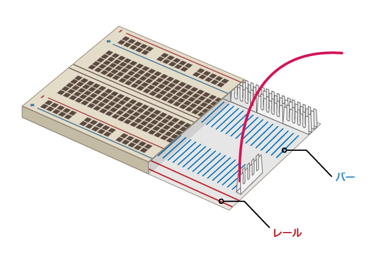

## 虹を作る

このステップでは、LEDで虹を作り、そのLEDが虹色に点滅するようにプログラムします。

\--- task \--- 使用するLEDをすべて取り出し、ジャンパー線と抵抗が必要数（LED1個につき各1本）あることを確認します。 \--- /task \---

\--- task \--- 虹の他の色のためのスペースを確保するために、すでにある回路を配置しなおします。 \--- /task \---

### 虹をグラウンドに

\--- task \--- 虹が明るく輝き、ジャンパー線で覆い隠されないようにするために、すべてのLEDで1つの**グラウンド（GND）**ピンを共有します。 ブレッドボード上の部品を少し並べ替えることで、このように組み上げることができます。

ブレッドボードはこのような構造です。

1本のジャンパー線で虹の全てをグラウンドに接続するには： \--- / task \---

\--- task \--- **GND**に接続されたジャンパー線をブレッドボードの**レール**に差し込みます。 \--- /task \---

\--- task \--- 抵抗が**GND**ジャンパー線と同じレールに接続されていることと、同じ回路のLEDの**バー**に接続されていることを確認します： \--- / task \---

### 虹を完成させる

\---タスク\--- 残りのLED、ジャンパー線、抵抗を、お好みの色の並べ方でブレッドボードに配置します。 最後の方は押しボタンスイッチのスペースを空けておいてください。 \--- /task \---

多くの異なる色を使用している場合は、ジャンパー線の色をLEDに合わせるとわかりやすいです。

虹はこのようになります。

