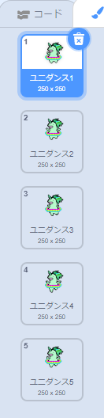

## ユニコーンを虹に合わせて踊らせる

このステップでは、虹のリズムに合わせて踊るユニコーンをスクラッチでプログラムします。 虹と踊るユニコーンのプログラムに、押しボタンスイッチを使います。

### ユニコーンのスプライト

ユニコーンスプライトを作成するに、次のいずれかの方法を選びます：

1. Scratchにあるユニコーンのスプライトを使用する
2. 他の場所で見つけたユニコーン画像をアップロードし、それをスプライトとして使用する
3. （右側の素敵な緑のユニコーンのように）ユニコーンのスプライトをスクラッチまたは別のプログラムを使って自分で作る。

例:

|              （1）スクラッチのスプライト：              |            （2）自分でアップロード：            |              （3）自分で作る：              |
|:-----------------------------------------:|:-----------------------------------:|:-----------------------------------:|
|  |  |  |

\--- task \--- オプション1を選ぶ場合は、ここをクリックしてください： [[[generic-scratch3-sprite-from-library]]] \--- / task \---

\--- task \--- 他の場所で見つけたユニコーン画像をアップロードするためにオプション2を選ぶ場合は、最初に以下をクリックして画像の使用許可について学び、次に2番目のボックスの指示に従ってファイルをアップロードします： [[[images-permissions-to-use]]]

[[[generic-scratch3-sprite-from-library]]] \--- /task \---

\--- task \--- オプション3を使用する場合、独自のユニコーンをスクラッチで描画する方法の説明は、以下をクリックしてください： [[[generic-scratch3-draw-sprite]]] \--- / task \---

### ユニコーンのコスチューム

ユニコーンには踊るための**コスチューム**が必要です コスチュームはスプライトの外観のセットの1つです。つまり、スプライトはコスチュームを変更することで外観を変えることができるのです。 したがって、アニメーションを作りたいときは、コスチュームを使用してスプライトが動いているように見せることができます。

ここでは、ユニコーンが躍るアニメーションを作るので、各コスチュームはユニコーンのダンスの動きを表すものになります。

\--- task \--- ダンス用にユニコーンのスプライトに何枚のコスチューム必要かを決め、それに応じてコスチュームを編集します。

スクラッチでコスチュームを追加する方法を確認するにはここをクリックしてください： [[[generic-scratch3-add-costume]]]

スクラッチでコスチュームを複製する方法を確認するにはここをクリックしてください： [[[generic-scratch3-duplicate-costumes]]] \--- / task \---

踊るユニコーンに追加するコスチュームの数はあなた次第です。 この踊る緑のユニコーンでは、5つのコスチュームを使いました。

|  |  |

### ユニコーンのダンス

ダンスアニメーションを作るには、ユニコーンをプログラムしてコスチュームを切り替える必要があります。

\--- task \--- 最初の2つのコスチュームを切り替えて、ユニコーンのダンスを開始します。

最初のコスチュームから2番目に切り替えるにはこれを使います：

```blocks3
switch costume to [costume 2 v]
```

ユニコーンは一般的に優れたダンサーなので、ユニコーンのダンスをレインボーパターンの速度に合わせるようにしてください。 `(1)秒待つ`{:class="blockcontrol"}ブロックを使用して、ユニコーンの待ち時間を虹の待ち時間に一致させます。

```blocks3
wait (0.5) secs
switch costume to [costume 2 v]
```

\--- /task \---

\--- task \--- 踊るユニコーンを作成するには、すべてのコスチュームを連続して切り替えます。 これを行うには、どのようなループが必要ですか？ \--- /task \---

\--- hints \--- \--- hint \---

ずっと ループを使用します。

```blocks3
ずっと
```

\--- /hint \--- \--- hint \---

このブロックを使用して、ループが一周するたびに次のコスチュームに切り替えます。

```blocks3
next costume
```

\--- /hint \--- \--- hint \---

コードは次のようになります:

```blocks3
forever
wait (0.5) secs
next costume
```

\--- /hint \--- \--- /hints \---