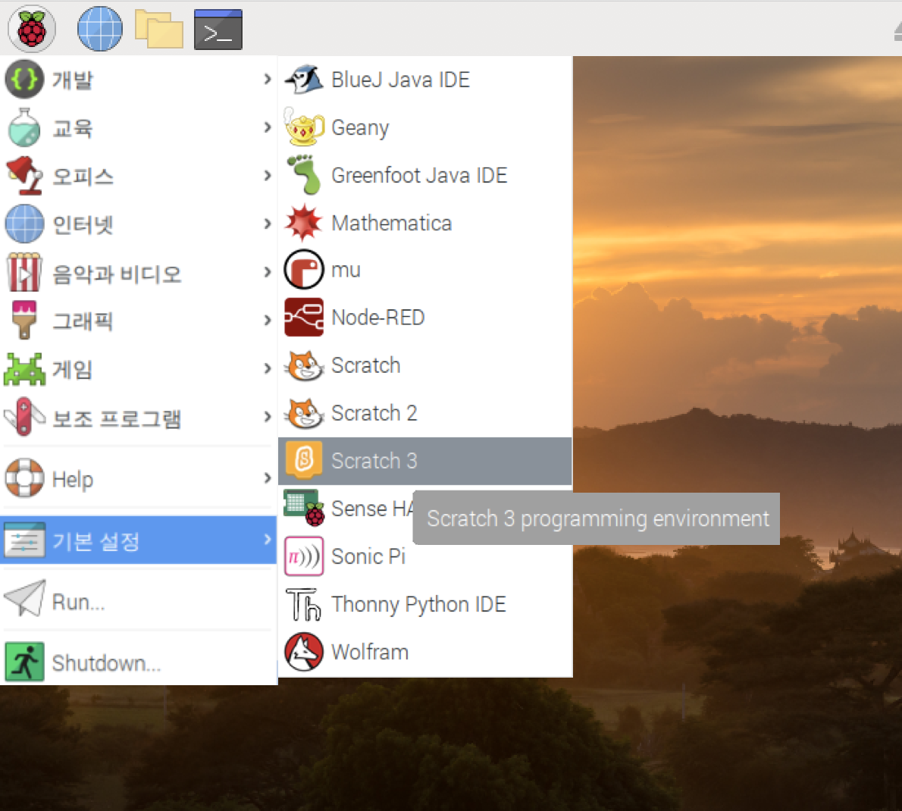

## 스크래치에서 회로 테스트하기

이제 회로와 첫 무지개 색을 스크래치에 연결하여 스크래치 프로그램을 코딩하여 LED를 제어 할 수 있습니다.

\--- task \--- Raspberry Pi에서 스크래치 3를 엽니다.

 \--- /task \---

\--- task \--- 그런 다음, Raspberry Pi Simple Electronics extension 확장을 추가하세요.


 \--- /task \---

\--- 작업 \--- 이전 단계에서 LED를 **3V3** 핀에 연결했습니다. 이 핀은 LED를 테스트하는 경우에 연결하는 핀입니다. 이제 스크래치로 제어 할 수있는 핀에 LED를 연결해야 합니다. 배선을 **3V3** 핀에서 **GPIO 17**과 같은 새로운 핀으로 옮겨주세요. \--- /task \---


\--- task \--- 이제 다음 간단한 스크립트를 사용하여 LED를 제어 할 수 있는지 테스트하세요.

```blocks3
when flag clicked
turn LED (17 v) [on v] ::extension
wait (1) secs
turn LED (17 v) [off v] ::extension
```

\--- /task \---

\--- task \--- 이제 녹색 깃발을 클릭하여 코드를 테스트하세요. LED가 1초 동안 켜질 것입니다. \--- /task \---