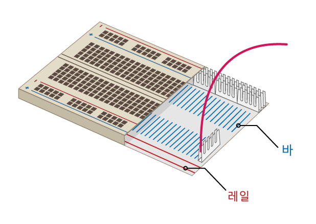

## 무지개 만들기

이 단계에서는 무지개를 조립하고 무지개 패턴에 따라 깜박이도록 LED를 프로그래밍합니다.

\--- task \--- 사용할 모든 LED를 찾고 올바른 수의 점퍼 케이블 및 저항(LED 당 하나씩)이 있는지 확인하세요. \--- /task \---

\--- task \--- 무지개의 다른 색을 위한 공간을 마련하기 위해 회로를 정리해주세요. \--- /task \---

### 무지개를 그라운드에 연결하기

\--- task \--- 무지개가 밝게 빛나고 지나치게 많은 점퍼 와이어로 가려지지 않도록, 모든 LED가 하나의 **그라운드(GND)**를 공유해야 합니다. 브레드 보드의 구성 요소를 약간 재정렬하여 이와 같이 설정할 수 있습니다.

브레드보드의 내부는 다음과 같이 생겼습니다:

하나의 점퍼 케이블만을 이용하여 전체 무지개를 접지하려면: \--- /task \---

\--- task \--- 브레드보드의 **레일**에 **GND**에 연결된 점퍼 와이어 연결합니다. \--- /task \---

\--- task \--- 저항이 **GND** 점퍼 케이블과 동일한 레일에 연결되고 그 저항에 대응되는 LED와 같은 **바**에 연결되어 있는지 확인하세요: \--- /task \---

### 무지개 완성하기

\--- task \--- 원하는 색상을 선택하여 브레드보드에 나머지 LED, 점퍼 케이블 및 저항을 추가합니다. 끝에 버튼을 위한 공간을 남기는 것을 잊지 마세요. \--- /task \---

다양한 색상을 사용하는 경우 점퍼 와이어의 색상을 LED에 일치시키는 것이 도움이 될 수 있습니다.

당신의 무지개는 이와 비슷할 것입니다:

