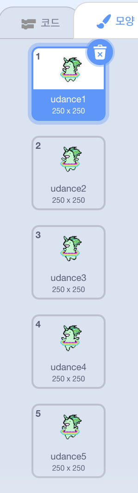

## 유니콘이 무지개를 따라 춤추게 하기

이 단계에서는 스크래치를 이용하여 무지개의 리듬에 맞춰 춤을 추는 유니콘을 프로그래밍합니다. 무지개와 춤추는 유니콘을 제어하기 위해 버튼을 사용할 것입니다.

### 유니콘 스프라이트

유니콘 스프라이트를 만들려면 다음 옵션 중 하나를 선택하세요:

1. 스크래치 유니콘 스프라이트 사용하기
2. 다른 곳에서 유니콘 이미지를 업로드하고 스프라이트로 사용하기
3. 스크래치 또는 다른 프로그램에서 (오른쪽의 사랑스러운 녹색 유니콘과 같은) 자신의 유니콘 스프라이트를 그리기

예시:

|            (1) 스크래치 스프라이트:             |         (2) 보유한 파일 업로드:         |            (3) 직접 그리기:             |
|:--------------------------------------:|:-------------------------------:|:----------------------------------:|
|  |  |  |

--- task --- 옵션 1을 선택했다면, 여기를 클릭하세요: 
[[[generic-scratch3-sprite-from-library]]] 
--- /task ---

--- task --- 다른 곳에서 찾은 유니콘 이미지를 업로드하기 위해 옵션 2를 선택한 경우, 먼저 아래를 클릭하여 이미지 권한에 대해 알아보고 두 번째 상자의 도움말을 사용하여 파일을 업로드하세요: 
[[[images-permissions-to-use]]]

[[[generic-scratch3-sprite-from-library]]] 
--- /task ---

--- task --- 옵션 3을 선택했다면, 스크래치에서 여러분 만의 유니콘을 그리는 방법을 아래의 지침에서 확인하세요. 
[[[generic-scratch3-draw-sprite]]] 
--- /task ---

### 유니콘의 의상

여러분의 유니콘은 춤을 추기 위해서 **의상**이 필요합니다. 스프라이트는 의상을 갈아입음으로써 보이는 모습을 바꿀수 있습니다. 그렇기때문에 여러분은 애니메이션을 제작할 때 의상을 사용해서 스프라이트가 움직이는 것처럼 보이게 할 수 있습니다.

여기에서는 여러분의 유니콘의 춤 동작을 각 의상에 부여해서 춤추는 유니콘 애니메이션을 만들것입니다.

여러분의 유니콘 스프라이트가 춤추게 하는데 필요한 의상의 숫자를 결정하고 의상을 편집합니다.

스크래치에서 의상을 추가하는 방법은 다음 에서 확인할 수 있습니다: 
[[[generic-scratch3-add-costume]]]

스크래치에서 의상을 복제하는 방법은 다음에서 확인할 수 있습니다: 
[[[generic-scratch3-duplicate-costumes]]]

유니콘이 춤추게 하는데 필요한 의상의 수는 여러분이 결정하면 됩니다. 이 춤추는 녹색 유니콘은 다섯 개의 의상을 사용했습니다.

|  |  |

### 춤추는 유니콘

춤추는 애니메이션을 만들려면 유니콘이 의상을 갈아입도록 프로그래밍 해야합니다.

--- task --- 유니콘이 춤을 시작하도록 첫번째 두번째 의상을 전환해봅시다.

첫번째 의상에서 두번째 의상으로 갈아입으려면 다음 블럭을 사용합니다.

```blocks3
switch costume to [costume 2 v]
```

유니콘은 춤을 아주 잘 춥니다. 유니콘이 무지개 패턴의 속도에 맞워서 춤을 추게 설정해 봅시다. `() 초 기다리기`{:class="blockcontrol"} 블럭을 사용해서 유니콘의 대기 시간과 뮤지개의 대기시간을 일치하게 합니다.

```blocks3
wait (0.5) secs
switch costume to [costume 2 v]
```

--- /task ---

유니콘이 춤을 추도록 모든 의상을 계속 전환해봅시다. 어떤 종류의 반복문이 필요할까요? --- /task ---

--- hints ---
 --- hint ---

무한 반복하기 블럭을 사용합시다.

```blocks3
무한 반복하기
```

--- /hint --- --- hint ---

이 블럭을 사용해서 반복문이 끝날때 마다 다음 의상으로 바뀌도록 합니다.

```blocks3
next costume
```

--- /hint --- --- hint ---

다음과 같은 코드가 될 것입니다.:

```blocks3
forever
wait (0.5) secs
next costume
```

--- /hint ------ /hints ---