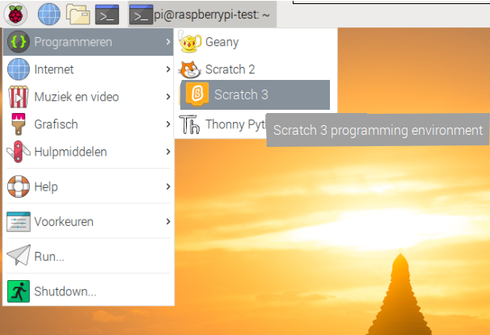

## Test je circuit in Scratch

Je verbindt nu je circuit met je eerste regenboogkleur via Scratch, zodat je een Scratch-programma kunt coderen om de LED te besturen.

\--- task \--- Open Scratch 3 op je Raspberry Pi.

 \--- /task \---

\--- task \--- Voeg dan de Raspberry Pi Simple Electronics-extensie toe


 \--- /task \---

\--- task \--- In de vorige stap heb je je LED aangesloten op pin **3V3**. Dit is de pin waarmee je verbinding kunt maken als je de LED test. Je moet nu je LED verbinden met een pin die je met Scratch kunt besturen. Verplaats de draad van pin **3V3** naar een nieuwe pin, bijvoorbeeld **GPIO 17**. \--- /task \---


\--- task \--- Test nu of de LED bestuurd kan worden met het volgende eenvoudige script

```blocks3
when flag clicked
turn LED (17 v) [on v] ::extension
wait (1) secs
turn LED (17 v) [off v] ::extension
```

\--- /task \---

\--- task \--- Klik op de groene vlag om de code uit te voeren. De LED zou 1 seconde aan moeten gaan. \--- /task \---