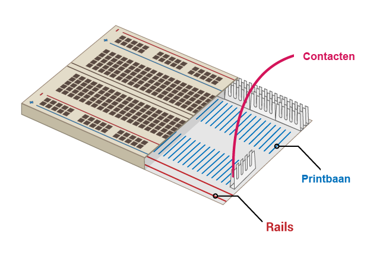

## Bouw je regenboog

In deze stap ga je je regenboog samenstellen en de LED's programmeren om in een regenboogpatroon te knipperen.

--- task --- Vind alle LED's die je gaat gebruiken en zorg ervoor dat je ook het juiste aantal verbindingsdraden en weerstanden hebt (één per LED). --- /task ---

--- taak --- Herschik het circuit dat je al hebt om ruimte te maken voor de andere kleuren van je regenboog. --- /task ---

### Aard de regenboog

--- task --- Om te zorgen dat je regenboog helder schijnt en niet bedekt wordt met te veel jumper draden, laat je alle LED's een **Aard (GND)** pin delen. Je kunt ze op deze manier opstellen door je componenten op het experimenteerbord een beetje te herschikken.

Het experimenteerbord ziet er van binnen zo uit:

Om de hele regenboog te aarden met één verbindingsdraad: --- /taak ---

--- task --- Sluit de verbindingsdraad die aangesloten is op **GND** aan op een **rail** van het experimenteerbord --- /task ---

--- task --- Zorg ervoor dat weerstanden aangesloten zijn met dezelfde rail als de **GND** verbindingsdraad en met dezelfde **printbaan** als de LED waartoe ze behoren: --- /task ---

### Maak de regenboog compleet

--- task --- Voeg de rest van je LED's, verbindingsdraden en weerstanden toe aan het experimenteerbord in een kleurenschema van jouw keuze. Zorg ervoor dat je ruimte laat voor een drukknop aan het eind. --- /task ---

Als je veel verschillende kleuren gebruikt, kan het helpen om de kleur van de verbindingsdraden te koppelen aan de kleur van je LED's.

Je regenboog zou er ongeveer zo uit moeten zien:

