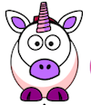
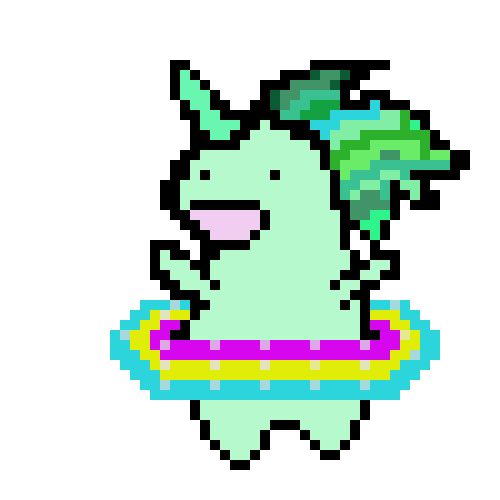

## Laat een eenhoorn dansen op je regenboog

In deze stap zul je een eenhoorn in Scratch programmeren die danst op het ritme van je regenboog. Je gebruikt een knop om je regenboog en dansende eenhoorn te programmeren.

### Eenhoorn sprite

Kies een van de volgende opties om een eenhoorn (unicorn) sprite te maken:

1. Gebruik de Scratch unicorn sprite
2. Upload een eenhoorn afbeelding van ergens anders en gebruik deze als sprite
3. Teken je eigen eenhoorn sprite in Scratch of een ander programma (zoals de mooie groene eenhoorn aan de rechterkant).

Voorbeelden:

|              (1) Scratch sprite:               |          (2) Upload je eigen:          |              (3) Teken je eigen:              |
|:----------------------------------------------:|:--------------------------------------:|:---------------------------------------------:|
|  |  |  |

\--- task \--- Als je optie 1 gekozen hebt, klik hier: [[[generic-scratch3-sprite-from-library]]] \--- /task \---

\--- task \--- Als je optie 2 hebt gekozen omdat je een eenhoorn afbeelding wilt uploaden die je ergens anders hebt gevonden, klik hieronder om te leren over afbeeldingstoestemmingen en gebruik vervolgens de instructies in het tweede vak om je bestand te uploaden: [[[images-permissions-to-use]]]

[[[generic-scratch3-sprite-from-library]]] \--- /task \---

\--- task \--- Als je voor optie 3 gaat klik hieronder voor instructies over hoe je je eigen eenhoorn in Scratch kunt tekenen: [[[generic-scratch3-draw-sprite]]] \--- /task \---

### Eenhoorn uiterlijken

Je eenhoorn heeft **uiterlijken** nodig om te dansen. Een uiterlijk is een van een reeks verschijningsvormen van een sprite, wat betekent dat sprites hun aangezicht kunnen veranderen door van uiterlijk te veranderen. Daarom kun je uiterlijken gebruiken om een sprite er uit te laten zien alsof hij beweegt om zo een animatie te maken.

Hier maken we een dansende eenhoorn-animatie, dus elk uiterlijk vertegenwoordigt een dansbeweging van je eenhoorn.

\--- task \--- Bepaal hoeveel uiterlijken je wilt dat je eenhoorn sprite voor het dansen heeft, en pas je uiterlijken dienovereenkomstig aan.

Klik voor een geheugensteuntje om uiterlijken aan Scratch toe te voegen op: [[[generic-scratch3-add-costume]]]

Klik voor een geheugensteuntje over hoe uiterlijken in Scratch te kopiëren: [[[generic-scratch3-duplicate-costumes]]] \--- /task \---

Het is aan jou om te bepalen hoeveel uiterlijken je wilt toevoegen voor je dansende eenhoorn. Voor deze dansende groene eenhoorn hebben we vijf uiterlijken gebruikt:

|  |  |

### Unicorn dans

Om je dansende animatie te maken, moet je de eenhoorn programmeren om van uiterlijk te wisselen.

\--- task \--- Schakel tussen de eerste twee uiterlijken om de eenhoorn dans te starten.

Om van het eerste naar het tweede uiterlijk te wisselen:

```blocks3
switch costume to [costume 2 v]
```

Eenhoorns zijn meestal goede dansers, dus zorg ervoor dat je je eenhoorns laat dansen op de snelheid van je regenboogpatroon. Je kunt het `wacht`{:class="block3control"} blok gebruiken om de wachttijd van de eenhoorn af te stemmen op de wachttijd van je regenboog.

```blocks3
wait (0.5) secs
switch costume to [costume 2 v]
```

\--- /task \---

\--- taak \--- Om je dansende eenhoorn te creëren, schakel je steeds tussen alle uiterlijken. Wat voor lus heb je hiervoor nodig? \--- /task \---

\--- hints \--- \--- hint \---

Gebruik een herhaal lus:

```blocks3
herhaal
```

\--- /hint \--- \--- hint \---

Gebruik dit blok om te schakelen naar het volgende uiterlijk wanneer je door de lus loopt:

```blocks3
next costume
```

\--- /hint \--- \--- hint \---

Je code zou er als volgt uit moeten zien:

```blocks3
forever
wait (0.5) secs
next costume
```

\--- /hint \--- \--- /hints \---