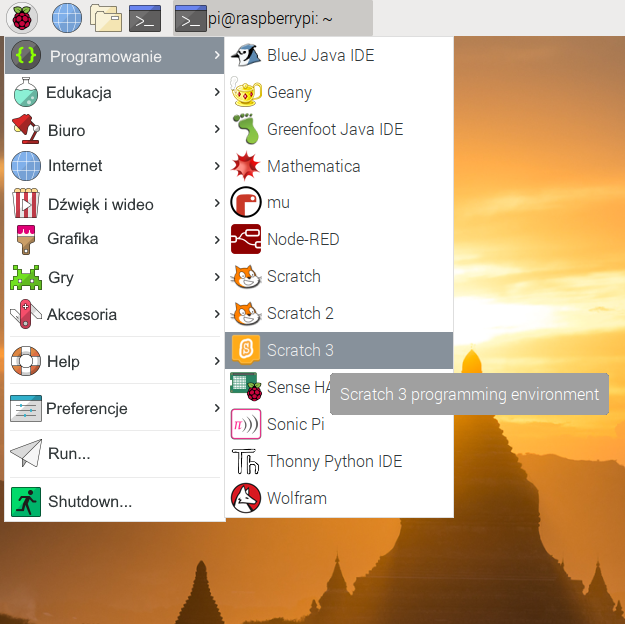
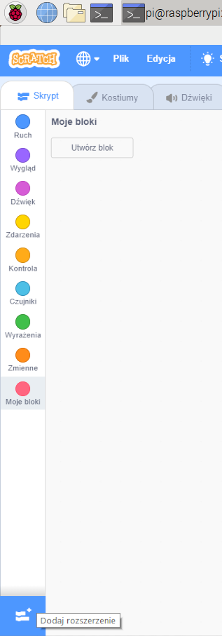
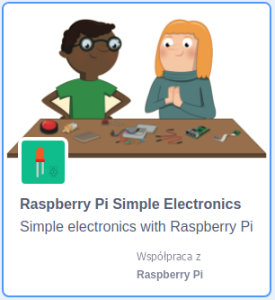

## Przetestuj swój obwód w Scratchu

Teraz podłączysz swój obwód i pierwszy kolor tęczowy do Scratcha, dzięki czemu możesz napisać program w Scratchu do sterowania diodą LED.

\--- task \--- Otwórz Scratch 3 na swoim Raspberry Pi.

 \--- /task \---

\--- task \--- Następnie dodaj rozszerzenie Raspberry Pi Simple Electronics extension



 \--- /task \---

\--- task \--- W poprzednim kroku podłączyłeś diodę LED, do pinu **3V3**. To jest pin do połączenia, jeśli testujesz diody LED. Teraz musisz podłączyć swoją diodę LED do pinu, którym można sterować ją za pomocą Scratcha. Przenieś drut z pinu **3V3** do nowego pinu, na przykład **GPIO 17**. \--- /task \---


\--- task \--- Teraz sprawdź, czy diodą LED można sterować za pomocą następującego prostego skryptu

```blocks3
when flag clicked
turn LED (17 v) [on v] ::extension
wait (1) secs
turn LED (17 v) [off v] ::extension
```

\--- /task \---

\--- task \--- Kliknij zieloną flagę, aby uruchomić program. Dioda LED powinna się włączyć na 1 sekundę. \--- /task \---