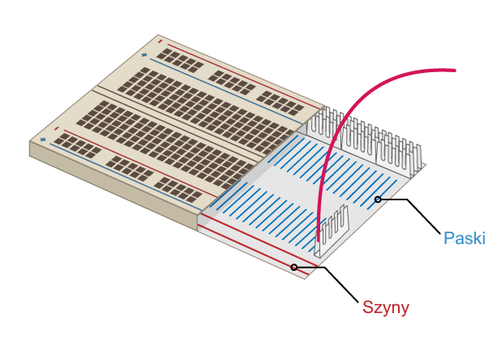

## Zbuduj swoją tęczę

W tym kroku zbudujesz tęczę i zaprogramujesz diody LED, tak aby mrugały we wzór tęczy.

\--- task \--- Znajdź wszystkie diody LED, których zamierzasz użyć, i upewnij się, że masz odpowiednią liczbę przewodów i rezystorów (po jednym na diodę). \--- /task \---

\---task\--- Przeorganizuj obwód, który już masz, żeby zrobić miejsce na inne kolory twojej tęczy. \--- /task \---

### Uziem tęczę

\--- task \--- Aby twoja tęcza świeciła jasno i nie była zasłonięta zbyt wieloma przewodami, wszystkie diody LED powinny współdzielić jeden pin** uziemienia (GND)**. Możesz to zrobić zmieniając trochę ułożenie komponentów na płytce stykowej.

Płytka stykowa wygląda w środku tak:

Aby uziemić całą tęczę za pomocą jednego przewodu: \--- /task \---

\---task\--- Podłącz przewód włożony do **GND** do **szyny** płytki stykowej \---/task\---

\---task\--- Upewnij się, czy wszystkie rezystory są podpięte do tej samej szyny co przewód podłączony do **GND** i do tego samego **paska** co dioda LED: \---/task\---

### Ukończ tęczę

\---task\--- Dodaj pozostałe diody LED, przewody połączeniowe i rezystory do płytki stykowej w wybranym przez siebie układzie kolorów. Pamiętaj, aby zostawić na końcu miejsce na przycisk. \--- /task \---

Jeśli używasz wielu różnych kolorów, może pomóc dopasowanie kolorów przewodów do diod LED.

Twoja tęcza powinna wyglądać podobnie do tej:

