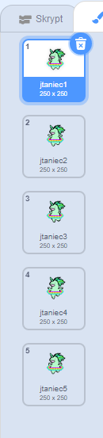

## Spraw aby jednorożec tańczył do twojej tęczy

W tym kroku zaprogramujesz jednorożca w Scratchu, który tańczy w rytmie twojej tęczy. Użyjesz przycisku do zaprogramowania tęczy i tańczenia jednorożca.

### Duszek jednorożca

Wybierz jedną z następujących opcji, aby stworzyć duszka jednorożca:

1. Użyj duszka Scratcha jednorożca
2. Prześlij obraz jednorożca z innego miejsca i użyj go jako duszka
3. Narysuj własnego duszka jednorożca w Scratch lub innym programie (jak piękny zielony jednorożec po prawej).

Przykłady:

|               (1) duszek Scratch:                |              (2) Prześlij własnego:              |             (3) Narysuj własnego:             |
|:------------------------------------------------:|:------------------------------------------------:|:---------------------------------------------:|
|  |  |  |

--- task --- Jeśli wybrałeś opcję 1, kliknij tutaj: 
[[[generic-scratch3-sprite-from-library]]] 
--- /task ---

--- task --- Jeśli wybrałeś opcję 2, ponieważ chcesz wgrać jednorodny obraz, który znalazłeś gdzieś indziej, kliknij poniżej, aby dowiedzieć się więcej o uprawnieniach do obrazu, a następnie użyj instrukcji w drugim polu, aby przesłać plik:
[[[images-permissions-to-use]]]

[[[generic-scratch3-sprite-from-library]]] 
--- /task ---

--- task --- Jeśli wybierasz opcję 3, kliknij poniżej, aby uzyskać instrukcję jak narysować własnego jednorożca w Scratchu: 
[[[generic-scratch3-draw-sprite]]] 
--- /task ---

### Kostiumy jednorożca

Twój jednorożec potrzebuje **kostiumów** aby mógł tańczyć. Kostium jest jednym z zestawów wyglądu duszka, co oznacza, że duszki mogą zmieniać swój wygląd, zmieniając kostiumy. Dlatego możesz używać kostiumów, aby duszek wyglądał, jakby się poruszał, ilekroć chcesz utworzyć animację.

Tutaj będziemy tworzyć animację tańczącego jednorożca, więc każdy kostium będzie reprezentował ruch twojego jednorożca.

--- task --- Zdecyduj, ile kostiumów ma mieć twój duszek jednorożca do tańca, i odpowiednio dostosuj kostiumy.

Kliknij, aby zobaczyć przypomnienie o dodawaniu kostiumów w Scratchu: 
[[[generic-scratch3-add-costume]]]

Kliknij, aby zobaczyć przypomnienie o powielaniu kostiumów w Scratchu: 
[[[generic-scratch3-duplicate-costumes] 

--- /task ---

Od Ciebie zależy, ile kostiumów chcesz dodać dla twojego tańczącego jednorożca. Dla tego tańczącego, zielonego jednorożca, użyliśmy pięciu kostiumów:

|  |  |

### Taniec jednorożca

Aby stworzyć animację tańca, musisz zaprogramować jednorożca do zmiany kostiumów.

--- task --- Przełączaj między dwoma pierwszymi kostiumami, aby rozpocząć taniec jednorożca.

Aby przełączyć z pierwszego na drugi kostium, użyj:

```blocks3
switch costume to [costume 2 v]
```

Jednorożce są na ogół dobrymi tancerzami, więc upewnij się, że jednorożec tańczy z szybkością wzoru tęczy. Możesz użyć bloku `czekaj`{:class="blockcontrol"}, aby dopasować czas oczekiwania jednorożca do czasu oczekiwania tęczy.

```blocks3
wait (0.5) secs
switch costume to [costume 2 v]
```

--- /task ---

--- task --- Aby stworzyć tańczącego jednorożca, przełączaj się między wszystkimi kostiumami w sposób ciągły. Jaką pętlę zastosować? --- /task ---

--- hints ---
 --- hint ---

Użyj pętli zawsze:

```blocks3
zawsze
```

--- /hint --- --- hint ---

Użyj tego bloku, aby przełączyć kostium za każdym razem, gdy przejdziesz przez pętlę:

```blocks3
next costume
```

--- /hint --- --- hint ---

Twój kod powinien wyglądać tak:

```blocks3
forever
wait (0.5) secs
next costume
```

--- /hint ------ /hints ---