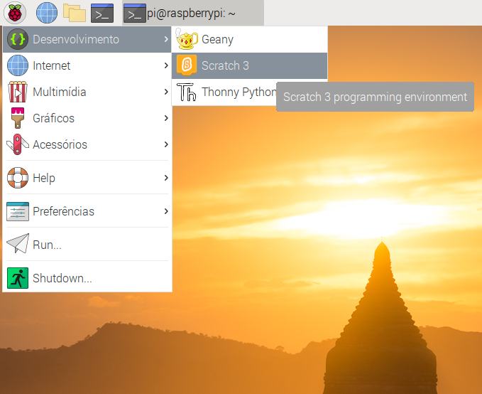
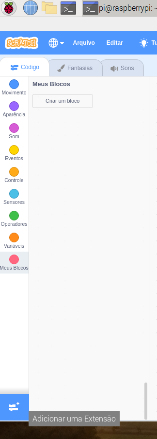

## Teste seu circuito no Scratch

Agora você conectará seu circuito e a primeira cor de arco-íris ao Scratch, para que você possa criar um programa Scratch para controlar o LED.

\--- task \--- Abra o Scratch 3 no seu Raspberry Pi.

 \--- /task \---

\--- task \--- Em seguida, adicione a extensão Raspberry Pi Simple Electronics



 \--- /task \---

\--- task \--- Na etapa anterior, você conectou seu LED ao pino **3V3**. Este é o pino que deve ser usado se você estiver testando seu LED. Agora você precisa conectar seu LED a um pino que você possa controlar com o Scratch. Mova o fio do pino **3V3** para um novo pino, por exemplo **GPIO 17**. \--- /task \---


\--- task \--- Agora teste se o LED pode ser controlado usando o seguinte código simples

```blocks3
when flag clicked
turn LED (17 v) [on v] ::extension
wait (1) secs
turn LED (17 v) [off v] ::extension
```

\--- /task \---

\--- task \--- Clique na bandeira verde para testar seu código. O LED deve acender por 1 segundo. \--- /task \---