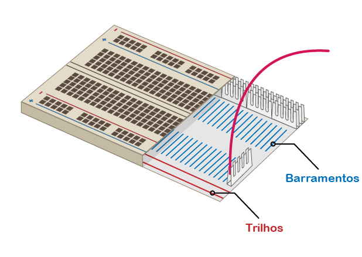

## Construa o seu arco-íris

Neste passo, você vai montar seu arco-íris e programar seus LEDs para piscar em um padrão de arco-íris.

--- task --- Encontre todos os LEDs que você vai usar e verifique também se possui o número certo de fios jumper e resistores (um de cada por LED). --- /task ---

--- task --- Reorganize o circuito que você já tem para abrir espaço para as outras cores do seu arco-íris. --- /task ---

### Aterre o arco-íris

--- task --- Para que o seu arco-íris brilhe intensamente e não seja coberto por muitos fios jumper, todos os LEDs devem compartilhar um pino **Terra (GND)**. Você pode configurá-los dessa maneira, reorganizando um pouco seus componentes na protoboard.

A protoboard é assim por dentro:

Para aterrar o arco-íris inteiro com um fio jumper: --- /task ---

--- task --- Conecte o fio jumper conectado ao **GND** a um **trilho** da protoboard --- /task ---

--- task --- Verifique se os resistores estão conectados ao mesmo trilho que o fio jumper **GND** e na mesma **barra** como o LED a que pertencem: --- /task ---

### Complete o arco-íris

--- task --- Adicione o resto dos seus LEDs, fios jumper e resistores à protoboard de acordo com as cores de sua escolha. Certifique-se de deixar espaço para um botão no final. --- /task ---

Se você está usando muitas cores diferentes, pode ajudar a combinar a cor dos fios jumper com a cor dos seus LEDs.

Seu arco-íris deve se parecer com este:

