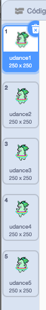

## Faça um unicórnio dançar com o seu arco-íris

Neste passo, você vai programar um unicórnio no Scratch que dança ao ritmo de seu arco-íris. Você usará um botão para programar seu arco-íris e seu unicórnio dançarino.

### Ator unicórnio

Escolha uma das seguintes opções para criar um ator de unicórnio:

1. Use o ator do unicórnio do Scratch
2. Carregue uma imagem de unicórnio de outro lugar e use-a como o seu ator
3. Desenhe o seu próprio ator unicórnio no Scratch ou outro programa (como o adorável unicórnio verde à direita).

Exemplos:

|                (1) ator do Scratch:                |        (2) Carregue o seu próprio:         |          (3) Desenhe o seu próprio:           |
|:--------------------------------------------------:|:------------------------------------------:|:---------------------------------------------:|
|  |  |  |

\--- task \--- Se você escolheu a opção 1, clique aqui: [[[generic-scratch3-sprite-from-library]]] \--- /task \---

\--- task \--- Se você escolheu a opção 2 porque quer carregar uma imagem unicórnio que você encontrou em outro lugar, primeiro clique abaixo para aprender sobre as permissões de imagem e, em seguida, use as instruções na segunda caixa para carregar o seu arquivo: [[[images-permissions-to-use]]]

[[[generic-scratch3-sprite-from-library]]] \--- /task \---

\--- task \--- Se você for pela opção 3, clique abaixo para obter instruções sobre como desenhar seu próprio unicórnio no Scratch: [[[generic-scratch3-draw-sprite]]] \--- /task \---

### Fantasias de unicórnio

Seu unicórnio precisa de **fantasias** para poder dançar. Uma fantasia é uma de um conjunto de aparências de um ator, o que significa que os atores podem mudar de visual mudando de fantasia. Portanto, você pode usar fantasias para fazer com que um ator pareça estar se movendo sempre que quiser criar uma animação.

Aqui, criaremos uma animação de um unicórnio dançarino, então cada fantasia representará um passo de dança do seu unicórnio.

\--- task \--- Decida quantas fantasias você deseja que o seu unicórnio tenha para a dança e edite suas fantasias de acordo.

Clique para um lembrete de como adicionar fantasias no Scratch: [[[generic-scratch3-add-costume]]]

Clique para um lembrete de como duplicar fantasias no Scratch: [[[generic-scratch3-duplicate-costumes]]] \--- /task \---

Você decide quantas fantasias quer adicionar para o seu unicórnio dançarino. Para este unicórnio dançarino verde, usamos cinco fantasias:

|  |  |

### Dança do unicórnio

Para criar a sua animação de dança, você precisa programar o unicórnio para trocar de fantasias.

\--- task \--- Alterne entre as duas primeiras fantasias para iniciar a dança do unicórnio.

Para mudar da primeira para a segunda fantasia, use:

```blocks3
switch costume to [costume 2 v]
```

Os unicórnios são geralmente bons dançarinos, então certifique-se de sincronizar a dança do seu unicórnio com a velocidade do seu padrão de arco-íris. Você pode usar o bloco `wait`{:class="blockcontrol"} para combinar o tempo de espera do unicórnio com o tempo de espera do seu arco-íris.

```blocks3
espere (1) seg
mude para a fantasia [udance2 v]
```

\--- /task \---

\--- tarefa \--- Para criar o seu unicórnio dançarino, alterne entre todas as fantasias continuamente. Que tipo de laço você precisa para fazer isso? \--- /task \---

\--- hints \--- \--- hint \---

Use um laço sempre:

```blocks3
sempre
```

\--- /hint \--- \--- hint \---

Use este bloco para alternar para a próxima fantasia toda vez que você passar pelo loop:

```blocks3
próxima fantasia
```

\--- /hint \--- \--- hint \---

Seu código deve ficar assim:

```blocks3
sempre
espere (0.5) seg
próxima fantasia
```

\--- /hint \--- \--- /hints \---