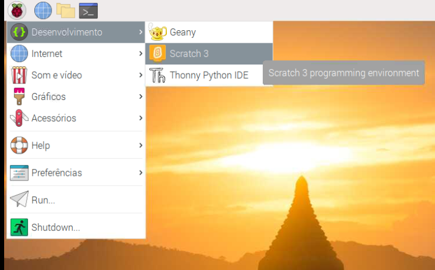
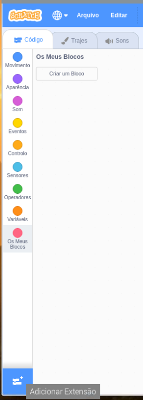

## Testa o teu circuito no Scratch

Tu irás agora ligar o teu circuito e a primeira cor do arco-íris ao Scratch, para que possas programar no Scratch como controlar o LED.

\--- task \--- Abre o Scratch 3 no teu Raspberry Pi.

 \--- /task \---

\--- task \--- Em seguida, adiciona a extensão Raspberry Pi Simple Electronics



 \--- /task \---

\--- task \--- Na etapa anterior, tu ligaste o teu LED ao pino **3V3**. Este é o pino ao qual deves ligar se estiveres a testar o teu LED. Agora precisas ligar o teu LED a um pino que possas controlar com o Scratch. Move o fio do pino **3V3** para um novo pino, por exemplo **GPIO 17**. \--- /task \---


\--- task \--- Agora testa se o LED pode ser controlado usando o seguinte programa simples

```blocks3
when flag clicked
turn LED (17 v) [on v] ::extension
wait (1) secs
turn LED (17 v) [off v] ::extension
```

\--- /task \---

\--- task \--- Clica na bandeira verde para executar o teu programa. O LED deve acender por 1 segundo. \--- /task \---