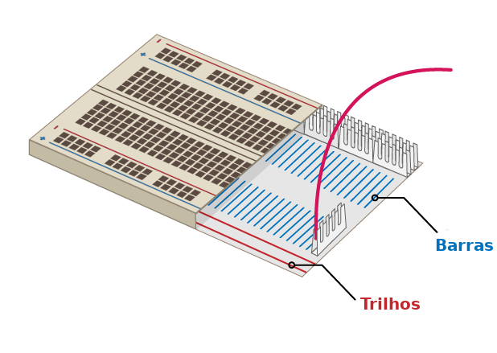

## Constrói o teu arco-íris

Neste passo, tu vais montar o teu arco-íris e programar os seus LEDs para piscar num padrão de arco-íris.

\--- tarefa \--- Encontra todos os LEDs que irás usar e verifica também se possuis o número certo de fios de ligação e resistências (um de cada por LED). \--- /task \---

\--- tarefa \--- Reorganiza o circuito que tu já tens para arranjar espaço para as outras cores do teu arco-íris. \--- /task \---

### Liga o arco-íris ao neutro

\--- tarefa \--- Para que o teu arco-íris brilhe intensamente e não seja coberto por muitos fios de ligação, todos os LEDs devem compartilhar um PINO **Neutro (GND)**. Tu podes configurá-los desta maneira, reorganizando o teus componentes na placa de ensaio.

A placa de ensaio é assim por dentro:

Para ligar o arco-íris inteiro ao neutro apenas com um fio de ligação: \--- / task \---

\--- tarefa \--- Liga o fio de ligação ligado ao **NEUTRO** a um **trilho** da placa de ensaio \--- / tarefa \---

\--- task \--- Verifica se as resistências estão ligadas ao mesmo trilho que o fio de ligação **Neutro** e na mesma **barra** como o LED a que pertencem: \--- / task \---

### Completa o arco-íris

\--- tarefa \--- Adiciona o resto dos teus LEDs, fios de ligação e resistências à placa de ensaio de acordo com a tua preferência de cores. Certifica-te de deixar espaço para um botão no final. \--- /task \---

Se estiveres a usar muitas cores diferentes, pode ajudar a combinar a cor dos fios de ligação com a cor dos teus LEDs.

O teu arco-íris deverá ser parecido com este:

