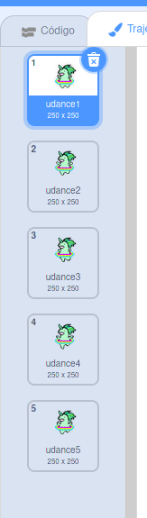

## Faz um unicórnio dançar com o teu arco-íris

Nesta passo, irás programar um unicórnio no Scratch que dança ao ritmo do teu arco-íris. Irás usar um botão para programar o teu arco-íris e unicórnio dançarino.

### Ator unicórnio

Escolhe uma das seguintes opções para criar um ator unicórnio:

1. Use o ator do unicórnio do Scratch
2. Carrega uma imagem de um unicórnio de outro lugar e usa-a como o teu ator
3. Desenha o teu próprio ator unicórnio no Scratch ou num outro programa (como o adorável unicórnio verde à direita).

Exemplos:

|                (1) ator do Scratch:                |           (2) Carrega o teu:            |              (3) Desenha o teu:               |
|:--------------------------------------------------:|:---------------------------------------:|:---------------------------------------------:|
|  |  |  |

\--- tarefa \--- Se escolheste a opção 1, clica aqui: [[[generic-scratch3-sprite-from-library]]] \--- /task \---

\--- tarefa \--- Se escolheste a opção 2 porque queres carregar uma imagem de um unicórnio que encontraste num outro lugar, clica em baixo primeiro para aprender sobre as permissões da imagem e, em seguida, use as instruções na segunda caixa para carregares o teu ficheiro: [[[images-permissions-to-use]]]

[[[generic-scratch3-sprite-from-library]]] \--- /task \---

\--- tarefa \--- Se fores para a opção 3, clica em baixo para obter instruções sobre como desenhar o teu próprio unicórnio no Scratch: [[[generic-scratch3-draw-sprite]]] \--- /task \---

### Trajes de unicórnio

O teu unicórnio precisa de **trajes** para ser capaz de dançar. Um traje é um de um conjunto de aparências de um ator, o que significa que os atores podem mudar de visual mudando de traje. Portanto, podes usar trajes para fazer um ator parecer que se está movendo sempre que quiseres criar uma animação.

Aqui, iremos criar uma animação de um unicórnio dançarino, pelo que cada traje representará um passo de dança do teu unicórnio.

\--- tarefa \--- Decide quantos trajes desejas que o teu ator unicórnio tenha para a dança e edita os teus trajes de acordo.

Clica para um lembrete de como adicionar trajes no Scratch: [[[generic-scratch3-add-costume]]]

Clica para um lembrete de como duplicar trajes no Scratch: [[[generic-scratch3-duplicate-costumes] \---

Tu é que decides quantos trajes queres adicionar para o teu unicórnio dançarino. Para este unicórnio dançarino verde, usamos cinco trajes:

|   |

### Dança do unicórnio

Para criar a tua animação da dança, precisas programar o unicórnio para trocar de traje.

\--- tarefa \--- Alterna entre os dois primeiros trajes para começar a dança do unicórnio.

Para mudar do primeiro para o segundo traje, usa:

```blocks3
switch costume to [costume 2 v]
```

Os unicórnios são geralmente bons dançarinos, então certifica-te de sincronizar a dança do teu unicórnio à velocidade do teu padrão de arco-íris. Podes usar o bloco `espera`{:class="blockcontrol"} para combinar o tempo de espera do unicórnio com o tempo de espera do teu arco-íris.

```blocks3
wait (0.5) secs
switch costume to [costume 2 v]
```

\--- /task \---

\--- tarefa \--- Para criar o teu unicórnio dançarino, alterna entre todos os trajes continuamente. Que tipo de ciclo precisas para fazer isso? \--- /task \---

\--- hints \--- \--- hint \---

Use um ciclo para sempre:

```blocks3
para sempre
```

\--- /hint \--- \--- hint \---

Use este bloco para alternar para o próximo traje cada vez que passar pelo ciclo:

```blocks3
next costume
```

\--- /hint \--- \--- hint \---

O teu código deverá ter este aspeto:

```blocks3
forever
wait (0.5) secs
next costume
```

\--- /hint \--- \--- /hints \---